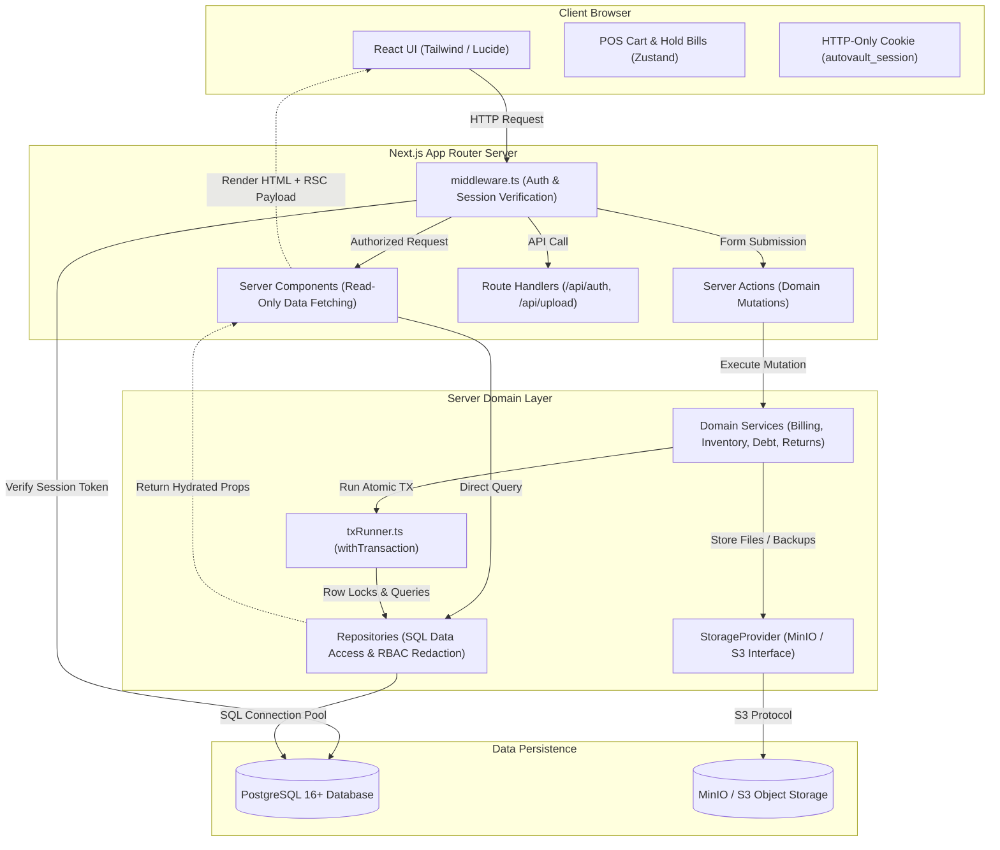

# AUTOVAULT — FINAL DATABASE & BACKEND ARCHITECTURE BLUEPRINT

**Document Version:** 1.0.0 (Final Architecture Freeze)  
**Status:** IMPLEMENTATION-READY SPECIFICATION  
**Authoritative Source of Truth:** Current Codebase (`src/lib/store.tsx`, `src/types/index.ts`, `src/lib/authUtils.ts`, `src/app/*`)  
**Supporting Evidence:** `AUTOVAULT_FULLSTACK_MIGRATION_FORENSIC_AUDIT.md`, `AUTOVAULT_POSTGRES_SCHEMA_REVIEW.md`  
**Target Platform:** PostgreSQL 16+, Next.js 15+ (App Router), Node.js LTS, MinIO / S3-compatible Storage  

---

## EXECUTIVE SUMMARY & OBJECTIVE

This specification freezes the complete database schema, domain transaction specifications, inventory invariants, financial mechanics, authentication architecture, and Next.js App Router / Server Component migration plan for AutoVault.

AutoVault is currently a single-shop automotive parts and billing ERP executing entirely in-browser against `localStorage` with a 4,678-line React context reducer (`store.tsx`). 

This blueprint provides **every database constraint, data type, locking sequence, mutation contract, route architecture, and data migration rule** required to construct the full-stack PostgreSQL backend without requiring the implementing engineer or subagent to make architectural decisions.

---

## TABLE OF CONTENTS

- [PHASE 1 — FINAL DATABASE SCHEMA](#phase-1--final-database-schema)
- [PHASE 2 — VARIANT MODEL](#phase-2--variant-model)
- [PHASE 3 — INVENTORY INVARIANTS](#phase-3--inventory-invariants)
- [PHASE 4 — WEIGHTED AVERAGE COST (WAC)](#phase-4--weighted-average-cost-wac)
- [PHASE 5 — TRANSACTION SPECIFICATIONS](#phase-5--transaction-specifications)
- [PHASE 6 — FINANCE & REVERSAL MODEL](#phase-6--finance--reversal-model)
- [PHASE 7 — CUSTOMER DEBT & STORE CREDIT](#phase-7--customer-debt--store-credit)
- [PHASE 8 — SUPPLIER FIFO MECHANICS](#phase-8--supplier-fifo-mechanics)
- [PHASE 9 — NUMBERING & SEQUENTIAL IDENTIFIERS](#phase-9--numbering--sequential-identifiers)
- [PHASE 10 — AUTHENTICATION & SESSION ARCHITECTURE](#phase-10--authentication--session-architecture)
- [PHASE 11 — NEXT.JS BACKEND ARCHITECTURE](#phase-11--nextjs-backend-architecture)
- [PHASE 12 — SSR & RSC MIGRATION MATRIX](#phase-12--ssr--rsc-migration-matrix)
- [PHASE 13 — GLOBAL STORE DECOMPOSITION](#phase-13--global-store-decomposition)
- [PHASE 14 — STORAGE & MINIO INTEGRATION](#phase-14--storage--minio-integration)
- [PHASE 15 — LOCALSTORAGE MIGRATION STRATEGY](#phase-15--localstorage-migration-strategy)
- [PHASE 16 — DATA INTEGRITY & INVARIANT CHECKLIST](#phase-16--data-integrity--invariant-checklist)
- [PHASE 17 — ERROR & CONCURRENCY MODEL](#phase-17--error--concurrency-model)
- [PHASE 18 — PERFORMANCE, INDEXING & PAGINATION](#phase-18--performance-indexing--pagination)
- [PHASE 19 — FINAL ARCHITECTURE DIAGRAMS](#phase-19--final-architecture-diagrams)
- [PHASE 20 — IMPLEMENTATION ROADMAP](#phase-20--implementation-roadmap)
- [FINAL OUTPUT SPECIFICATIONS](#final-output-specifications)
- [VERDICT](#verdict)

---

# PHASE 1 — FINAL DATABASE SCHEMA

All tables are defined in PostgreSQL 16+ dialect. Types match the actual operational domain needs verified in the codebase.

### 1.1 `users`
Represents application accounts (Owner / Staff).

```sql
CREATE TABLE users (
  id            UUID PRIMARY KEY DEFAULT gen_random_uuid(),
  username      TEXT NOT NULL,
  password_hash TEXT NOT NULL,
  salt          TEXT,                                             -- Retained for legacy password hash verification
  legacy_hash   BOOLEAN NOT NULL DEFAULT false,                   -- True if password_hash is from client-side polynomial hash
  role          TEXT NOT NULL CHECK (role IN ('owner', 'staff')),
  is_active     BOOLEAN NOT NULL DEFAULT true,
  created_at    TIMESTAMPTZ NOT NULL DEFAULT NOW(),
  updated_at    TIMESTAMPTZ NOT NULL DEFAULT NOW()
);

CREATE UNIQUE INDEX idx_users_username_ci ON users (lower(username));
```
- **Mutable Fields:** `password_hash`, `salt`, `legacy_hash`, `role`, `is_active`, `updated_at`
- **Immutable Fields:** `id`, `created_at`
- **Snapshot/Audit:** `created_at`, `updated_at`

### 1.2 `user_sessions`
Server-authoritative HTTP-only session tokens.

```sql
CREATE TABLE user_sessions (
  id          UUID PRIMARY KEY DEFAULT gen_random_uuid(),
  user_id     UUID NOT NULL REFERENCES users(id) ON DELETE CASCADE,
  token_hash  TEXT NOT NULL UNIQUE,                               -- SHA-256 hash of random session cookie token
  role        TEXT NOT NULL CHECK (role IN ('owner', 'staff')),    -- Cached role for instant middleware evaluation
  expires_at  TIMESTAMPTZ NOT NULL,
  created_at  TIMESTAMPTZ NOT NULL DEFAULT NOW()
);

CREATE INDEX idx_user_sessions_token ON user_sessions(token_hash);
CREATE INDEX idx_user_sessions_user_id ON user_sessions(user_id);
CREATE INDEX idx_user_sessions_expires_at ON user_sessions(expires_at);
```
- **Mutable Fields:** `expires_at`
- **Immutable Fields:** `id`, `user_id`, `token_hash`, `role`, `created_at`

### 1.3 `shop_settings`
Single-row configuration matching `ShopSettings` in `src/app/settings/page.tsx:54-68`.

```sql
CREATE TABLE shop_settings (
  id             TEXT PRIMARY KEY DEFAULT 'singleton' CHECK (id = 'singleton'),
  shop_name      TEXT NOT NULL DEFAULT '7 Star Car Accessories',
  owner_name     TEXT NOT NULL DEFAULT 'Owner',
  phone          TEXT NOT NULL DEFAULT '7448138484',
  email          TEXT NOT NULL DEFAULT '',
  address        TEXT NOT NULL DEFAULT 'Sambhaji Chowk Road, Near Veershav Bank, Ichalkaranji',
  gst_number     TEXT NOT NULL DEFAULT '',
  invoice_prefix TEXT NOT NULL DEFAULT 'INV',
  currency       TEXT NOT NULL DEFAULT '₹',
  show_logo      BOOLEAN NOT NULL DEFAULT true,
  show_gst       BOOLEAN NOT NULL DEFAULT true,
  show_address   BOOLEAN NOT NULL DEFAULT true,
  show_phone     BOOLEAN NOT NULL DEFAULT true,
  footer_message TEXT NOT NULL DEFAULT 'This is a computerized Cash/Credit Memo. Thank you for shopping with us!',
  theme          TEXT NOT NULL DEFAULT 'light' CHECK (theme IN ('light', 'dark', 'system')),
  updated_at     TIMESTAMPTZ NOT NULL DEFAULT NOW()
);
```
- **Mutable Fields:** All configuration values, `updated_at`
- **Immutable Fields:** `id`

### 1.4 `finance_accounts`
The 3 static core liquid asset accounts (`acc-cash`, `acc-upi`, `acc-bank`).

```sql
CREATE TABLE finance_accounts (
  id              TEXT PRIMARY KEY,                               -- 'acc-cash', 'acc-upi', 'acc-bank'
  name            TEXT NOT NULL,
  type            TEXT NOT NULL CHECK (type IN ('Cash', 'Bank', 'UPI')),
  opening_balance NUMERIC(12,4) NOT NULL DEFAULT 0,
  created_at      TIMESTAMPTZ NOT NULL DEFAULT NOW(),
  updated_at      TIMESTAMPTZ NOT NULL DEFAULT NOW()
);
```
- **Mutable Fields:** `opening_balance`, `name`, `updated_at`
- **Derived Fields:** Current balance is DERIVED via `opening_balance + SUM(Income) - SUM(Expense)` from `finance_transactions`.
- **Immutable Fields:** `id`, `type`, `created_at`

### 1.5 `suppliers`
Vendor master entity.

```sql
CREATE TABLE suppliers (
  id             UUID PRIMARY KEY DEFAULT gen_random_uuid(),
  name           TEXT NOT NULL,
  contact_person TEXT NOT NULL DEFAULT '',
  phone          TEXT NOT NULL DEFAULT '',
  whatsapp       TEXT NOT NULL DEFAULT '',
  email          TEXT NOT NULL DEFAULT '',
  address        TEXT NOT NULL DEFAULT '',
  gst_number     TEXT,
  notes          TEXT NOT NULL DEFAULT '',
  status         TEXT NOT NULL DEFAULT 'Active' CHECK (status IN ('Active', 'Inactive')),
  created_at     TIMESTAMPTZ NOT NULL DEFAULT NOW(),
  updated_at     TIMESTAMPTZ NOT NULL DEFAULT NOW()
);

CREATE INDEX idx_suppliers_name ON suppliers(name);
CREATE INDEX idx_suppliers_phone ON suppliers(phone);
CREATE INDEX idx_suppliers_status ON suppliers(status);
```
- **Constraints:** Phone uniqueness is NOT enforced at database level because legacy data allows duplicates.
- **Derived Fields:** Outstanding due balance is DERIVED via FIFO purchase calculation.
- **Mutable Fields:** `name`, `contact_person`, `phone`, `whatsapp`, `email`, `address`, `gst_number`, `notes`, `status`, `updated_at`
- **Immutable Fields:** `id`, `created_at`

### 1.6 `customers`
Customer entity.

```sql
CREATE TABLE customers (
  id          UUID PRIMARY KEY DEFAULT gen_random_uuid(),
  name        TEXT NOT NULL,
  phone       TEXT NOT NULL DEFAULT '',
  visits      INTEGER NOT NULL DEFAULT 0,
  last_visit  DATE,
  created_at  TIMESTAMPTZ NOT NULL DEFAULT NOW(),
  updated_at  TIMESTAMPTZ NOT NULL DEFAULT NOW()
);

CREATE INDEX idx_customers_phone ON customers(phone);
CREATE INDEX idx_customers_name ON customers(name);
```
- **Derived Fields:** 
  - `debt` is DERIVED from `SUM(due_amount)` on non-voided invoices.
  - `store_credit` is DERIVED from `customer_credit_transactions`.
  - `total_spent` is DEPRECATED and NOT migrated.
  - `invoice_ids` is DERIVED from `invoices.customer_id`.
- **Mutable Fields:** `name`, `phone`, `visits`, `last_visit`, `updated_at`
- **Immutable Fields:** `id`, `created_at`

### 1.7 `products`
Concrete SKU product master. Every SKU/variant is an independent row.

```sql
CREATE TABLE products (
  id                    UUID PRIMARY KEY DEFAULT gen_random_uuid(),
  sku                   TEXT NOT NULL,
  name                  TEXT NOT NULL,
  brand                 TEXT NOT NULL DEFAULT '',
  category              TEXT NOT NULL DEFAULT '',
  stock                 INTEGER NOT NULL DEFAULT 0 CHECK (stock >= 0),
  current_cost          NUMERIC(12,4) NOT NULL DEFAULT 0 CHECK (current_cost >= 0), -- Operational WAC
  sell_price            NUMERIC(12,4) NOT NULL DEFAULT 0 CHECK (sell_price >= 0),
  low_stock_threshold   INTEGER NOT NULL DEFAULT 5 CHECK (low_stock_threshold >= 0),
  status                TEXT NOT NULL DEFAULT 'Active' CHECK (status IN ('Active', 'Inactive', 'Discontinued')),
  is_universal_fit      BOOLEAN NOT NULL DEFAULT false,
  display_group         TEXT,                                                      -- Visual grouping key for variants
  variant_options       JSONB,                                                     -- VariantOptionDefinition[]
  variant_values        JSONB,                                                     -- Record<string, string>
  preferred_supplier_id UUID REFERENCES suppliers(id) ON DELETE SET NULL,
  hsn                   TEXT,
  gst_rate              NUMERIC(5,2) DEFAULT 0 CHECK (gst_rate >= 0 AND gst_rate <= 100),
  location              TEXT,
  description           TEXT,
  created_at            TIMESTAMPTZ NOT NULL DEFAULT NOW(),
  updated_at            TIMESTAMPTZ NOT NULL DEFAULT NOW()
);

CREATE UNIQUE INDEX idx_products_sku_ci ON products (lower(sku));
CREATE INDEX idx_products_brand ON products(brand);
CREATE INDEX idx_products_category ON products(category);
CREATE INDEX idx_products_status ON products(status);
CREATE INDEX idx_products_display_group ON products(display_group) WHERE display_group IS NOT NULL;
CREATE UNIQUE INDEX idx_products_group_variant_combo ON products (display_group, variant_values) 
  WHERE display_group IS NOT NULL AND variant_values IS NOT NULL;
```
- **Mutable Fields:** `name`, `brand`, `category`, `stock`, `current_cost`, `sell_price`, `low_stock_threshold`, `status`, `is_universal_fit`, `display_group`, `variant_options`, `variant_values`, `preferred_supplier_id`, `hsn`, `gst_rate`, `location`, `description`, `updated_at`
- **Immutable Fields:** `id`, `created_at` (SKU is mutable only if no transaction history exists, else restricted).

### 1.8 `product_fitments`
Vehicle compatibility table for products.

```sql
CREATE TABLE product_fitments (
  id            UUID PRIMARY KEY DEFAULT gen_random_uuid(),
  product_id    UUID NOT NULL REFERENCES products(id) ON DELETE CASCADE,
  vehicle_brand TEXT NOT NULL,
  model         TEXT NOT NULL,
  year_from     TEXT NOT NULL,                                            -- String e.g. "2015"
  year_to       TEXT,                                                     -- Optional end year e.g. "2020"
  created_at    TIMESTAMPTZ NOT NULL DEFAULT NOW(),

  CONSTRAINT uq_product_fitment UNIQUE (product_id, vehicle_brand, model, year_from)
);

CREATE INDEX idx_product_fitments_product ON product_fitments(product_id);
CREATE INDEX idx_product_fitments_lookup ON product_fitments(vehicle_brand, model, year_from);
```

### 1.9 `purchase_orders`
Purchase order master record.

```sql
CREATE TABLE purchase_orders (
  id                     UUID PRIMARY KEY DEFAULT gen_random_uuid(),
  po_number              TEXT NOT NULL UNIQUE,                             -- e.g. PO-2026-00001
  supplier_id            UUID NOT NULL REFERENCES suppliers(id) ON DELETE RESTRICT,
  expected_delivery_date DATE,
  notes                  TEXT NOT NULL DEFAULT '',
  status                 TEXT NOT NULL DEFAULT 'Draft' CHECK (status IN (
    'Draft', 'Sent', 'Supplier Confirmed', 'Partially Delivered', 'Completed', 'Cancelled'
  )),
  created_at             TIMESTAMPTZ NOT NULL DEFAULT NOW(),
  updated_at             TIMESTAMPTZ NOT NULL DEFAULT NOW()
);

CREATE INDEX idx_purchase_orders_supplier ON purchase_orders(supplier_id);
CREATE INDEX idx_purchase_orders_status ON purchase_orders(status);
```

### 1.10 `purchase_order_items`
Line items for purchase orders.

```sql
CREATE TABLE purchase_order_items (
  id                 UUID PRIMARY KEY DEFAULT gen_random_uuid(),
  purchase_order_id  UUID NOT NULL REFERENCES purchase_orders(id) ON DELETE CASCADE,
  product_id         UUID NOT NULL REFERENCES products(id) ON DELETE RESTRICT,
  quantity           INTEGER NOT NULL CHECK (quantity > 0),
  expected_buy_price NUMERIC(12,4) NOT NULL DEFAULT 0 CHECK (expected_buy_price >= 0),
  received_quantity  INTEGER NOT NULL DEFAULT 0 CHECK (received_quantity >= 0),
  created_at         TIMESTAMPTZ NOT NULL DEFAULT NOW()
);

CREATE INDEX idx_po_items_po_id ON purchase_order_items(purchase_order_id);
CREATE INDEX idx_po_items_product_id ON purchase_order_items(product_id);
```

### 1.11 `purchase_order_activity_logs`
Audit logs for purchase order status transitions.

```sql
CREATE TABLE purchase_order_activity_logs (
  id                 UUID PRIMARY KEY DEFAULT gen_random_uuid(),
  purchase_order_id  UUID NOT NULL REFERENCES purchase_orders(id) ON DELETE CASCADE,
  type               TEXT NOT NULL CHECK (type IN (
    'Created', 'Edited', 'Sent', 'Confirmed', 'Delivery', 'Completed', 'Cancelled'
  )),
  notes              TEXT NOT NULL DEFAULT '',
  performed_by       TEXT,
  created_at         TIMESTAMPTZ NOT NULL DEFAULT NOW()
);

CREATE INDEX idx_po_activity_po_id ON purchase_order_activity_logs(purchase_order_id);
```

### 1.12 `purchases`
Inventory inbound purchases (WAC source & supplier liability).

```sql
CREATE TABLE purchases (
  id                 UUID PRIMARY KEY DEFAULT gen_random_uuid(),
  supplier_id        UUID NOT NULL REFERENCES suppliers(id) ON DELETE RESTRICT,
  product_id         UUID NOT NULL REFERENCES products(id) ON DELETE RESTRICT,
  purchase_order_id  UUID REFERENCES purchase_orders(id) ON DELETE SET NULL,
  quantity           INTEGER NOT NULL CHECK (quantity > 0),
  buy_price          NUMERIC(12,4) NOT NULL CHECK (buy_price > 0),         -- Snapshot cost per unit
  total_amount       NUMERIC(12,4) NOT NULL CHECK (total_amount > 0),      -- quantity * buy_price
  amount_paid        NUMERIC(12,4) NOT NULL DEFAULT 0 CHECK (amount_paid >= 0),
  due_amount         NUMERIC(12,4) NOT NULL DEFAULT 0 CHECK (due_amount >= 0),
  returned_quantity  INTEGER NOT NULL DEFAULT 0 CHECK (returned_quantity >= 0),
  invoice_number     TEXT NOT NULL DEFAULT '',                             -- Vendor invoice reference
  purchase_date      DATE NOT NULL,
  payment_status     TEXT NOT NULL CHECK (payment_status IN ('Paid', 'Partial', 'Credit')),
  notes              TEXT NOT NULL DEFAULT '',
  expected_buy_price NUMERIC(12,4),                                        -- Cost variance analysis
  created_at         TIMESTAMPTZ NOT NULL DEFAULT NOW(),                   -- MANDATORY FOR FIFO ORDERING
  updated_at         TIMESTAMPTZ NOT NULL DEFAULT NOW()
);

CREATE INDEX idx_purchases_supplier_id ON purchases(supplier_id);
CREATE INDEX idx_purchases_product_id ON purchases(product_id);
CREATE INDEX idx_purchases_fifo_order ON purchases(supplier_id, created_at, purchase_date);
CREATE INDEX idx_purchases_payment_status ON purchases(payment_status);
```
- **Immutable Fields:** `id`, `supplier_id`, `product_id`, `purchase_order_id`, `quantity`, `buy_price`, `total_amount`, `created_at`
- **Mutable Fields:** `amount_paid`, `due_amount`, `returned_quantity`, `payment_status`, `invoice_number`, `purchase_date`, `notes`, `updated_at`

### 1.13 `purchase_returns`
Outbound goods returns to suppliers.

```sql
CREATE TABLE purchase_returns (
  id                          UUID PRIMARY KEY DEFAULT gen_random_uuid(),
  purchase_id                 UUID NOT NULL REFERENCES purchases(id) ON DELETE RESTRICT,
  supplier_id                 UUID NOT NULL REFERENCES suppliers(id) ON DELETE RESTRICT,
  product_id                  UUID NOT NULL REFERENCES products(id) ON DELETE RESTRICT,
  quantity                    INTEGER NOT NULL CHECK (quantity > 0),
  buy_price                   NUMERIC(12,4) NOT NULL CHECK (buy_price > 0),
  total_amount                NUMERIC(12,4) NOT NULL CHECK (total_amount > 0), -- Goods value: qty * buy_price
  refund_amount               NUMERIC(12,4) NOT NULL DEFAULT 0 CHECK (refund_amount >= 0), -- Cash refund received
  reason                      TEXT NOT NULL DEFAULT '',
  returned_by                 TEXT NOT NULL CHECK (returned_by IN ('Owner', 'Staff')),
  original_purchase_quantity  INTEGER NOT NULL,                               -- Historical snapshot
  original_purchase_value     NUMERIC(12,4) NOT NULL,                         -- Historical snapshot
  created_at                  TIMESTAMPTZ NOT NULL DEFAULT NOW()
);

CREATE INDEX idx_purchase_returns_purchase ON purchase_returns(purchase_id);
CREATE INDEX idx_purchase_returns_supplier ON purchase_returns(supplier_id);
```
- **Immutable Table:** Rows are append-only audit records. No updates or deletions allowed.

### 1.14 `supplier_payments`
Supplier repayment transaction ledger.

```sql
CREATE TABLE supplier_payments (
  id          UUID PRIMARY KEY DEFAULT gen_random_uuid(),
  supplier_id UUID NOT NULL REFERENCES suppliers(id) ON DELETE RESTRICT,
  purchase_id UUID NOT NULL REFERENCES purchases(id) ON DELETE RESTRICT,
  amount      NUMERIC(12,4) NOT NULL CHECK (amount > 0),
  method      TEXT NOT NULL CHECK (method IN ('Cash', 'UPI', 'Card', 'Bank')),
  is_upfront  BOOLEAN NOT NULL DEFAULT false,
  note        TEXT,
  paid_by     TEXT NOT NULL CHECK (paid_by IN ('Owner', 'Staff')),
  created_at  TIMESTAMPTZ NOT NULL DEFAULT NOW()
);

CREATE INDEX idx_supplier_payments_supplier ON supplier_payments(supplier_id);
CREATE INDEX idx_supplier_payments_purchase ON supplier_payments(purchase_id);
```
- **Immutable Table:** Payments are append-only ledger entries.

### 1.15 `invoices`
Sales invoices master record.

```sql
CREATE TABLE invoices (
  id              UUID PRIMARY KEY DEFAULT gen_random_uuid(),
  invoice_number  TEXT NOT NULL UNIQUE,                                     -- e.g. INV-2026-0001
  customer_id     UUID REFERENCES customers(id) ON DELETE RESTRICT,         -- NULL for walk-in
  customer_name   TEXT NOT NULL DEFAULT 'Walk-in Customer',                 -- Snapshot
  customer_phone  TEXT NOT NULL DEFAULT '',                                 -- Snapshot
  vehicle_number  TEXT NOT NULL DEFAULT '',
  vehicle_model   TEXT NOT NULL DEFAULT '',
  payment_method  TEXT NOT NULL CHECK (payment_method IN ('Cash', 'UPI', 'Card')),
  payment_status  TEXT NOT NULL CHECK (payment_status IN (
    'Paid', 'Partial', 'Credit', 'Paid (Credit Redeemed)', 'Pending', 'Overdue', 'Voided'
  )),
  amount_paid     NUMERIC(12,4) NOT NULL DEFAULT 0 CHECK (amount_paid >= 0),
  due_amount      NUMERIC(12,4) NOT NULL DEFAULT 0 CHECK (due_amount >= 0),
  subtotal        NUMERIC(12,4) NOT NULL CHECK (subtotal >= 0),
  discount        NUMERIC(5,2) NOT NULL DEFAULT 0 CHECK (discount >= 0 AND discount <= 100),
  total           NUMERIC(12,4) NOT NULL CHECK (total >= 0),                -- subtotal * (1 - discount/100)
  credit_redeemed NUMERIC(12,4) NOT NULL DEFAULT 0 CHECK (credit_redeemed >= 0),
  notes           TEXT NOT NULL DEFAULT '',
  invoice_date    DATE NOT NULL,
  billed_by       TEXT CHECK (billed_by IN ('Owner', 'Staff')),
  voided          BOOLEAN NOT NULL DEFAULT false,
  voided_at       TIMESTAMPTZ,
  void_reason     TEXT,
  voided_by       TEXT,
  shop_snapshot   JSONB,                                                    -- Shop address/phone/GST snapshot
  created_at      TIMESTAMPTZ NOT NULL DEFAULT NOW(),                       -- MANDATORY FOR FIFO REPAYMENT
  updated_at      TIMESTAMPTZ NOT NULL DEFAULT NOW()
);

CREATE INDEX idx_invoices_customer_id ON invoices(customer_id);
CREATE INDEX idx_invoices_date ON invoices(invoice_date);
CREATE INDEX idx_invoices_fifo_order ON invoices(customer_id, created_at, invoice_date);
CREATE INDEX idx_invoices_voided ON invoices(voided);
CREATE INDEX idx_invoices_payment_status ON invoices(payment_status);
```
- **Immutable Fields:** `id`, `invoice_number`, `customer_name`, `customer_phone`, `subtotal`, `discount`, `total`, `credit_redeemed`, `invoice_date`, `billed_by`, `shop_snapshot`, `created_at`
- **Mutable Fields:** `amount_paid`, `due_amount`, `payment_status`, `voided`, `voided_at`, `void_reason`, `voided_by`, `notes`, `updated_at`

### 1.16 `invoice_items`
Line items for sales invoices with historical cost and price snapshots.

```sql
CREATE TABLE invoice_items (
  id                UUID PRIMARY KEY DEFAULT gen_random_uuid(),
  invoice_id        UUID NOT NULL REFERENCES invoices(id) ON DELETE CASCADE,
  product_id        UUID NOT NULL REFERENCES products(id) ON DELETE RESTRICT,
  product_name      TEXT NOT NULL,                                          -- Snapshot at sale
  quantity          INTEGER NOT NULL CHECK (quantity > 0),
  sell_price        NUMERIC(12,4) NOT NULL CHECK (sell_price >= 0),         -- Snapshot sale price
  cost_price        NUMERIC(12,4) NOT NULL DEFAULT 0 CHECK (cost_price >= 0), -- Snapshot WAC at sale
  returned_quantity INTEGER NOT NULL DEFAULT 0 CHECK (returned_quantity >= 0), -- Mutable return cache
  created_at        TIMESTAMPTZ NOT NULL DEFAULT NOW()
);

CREATE INDEX idx_invoice_items_invoice ON invoice_items(invoice_id);
CREATE INDEX idx_invoice_items_product ON invoice_items(product_id);
```
- **Immutable Fields:** `id`, `invoice_id`, `product_id`, `product_name`, `quantity`, `sell_price`, `cost_price`, `created_at`
- **Mutable Fields:** `returned_quantity` (modified by returns and return cancellations).

### 1.17 `debt_payments`
Customer repayment transactions.

```sql
CREATE TABLE debt_payments (
  id             UUID PRIMARY KEY DEFAULT gen_random_uuid(),
  receipt_number TEXT UNIQUE,                                              -- e.g. PAY-000001
  customer_id    UUID NOT NULL REFERENCES customers(id) ON DELETE RESTRICT,
  invoice_id     UUID NOT NULL REFERENCES invoices(id) ON DELETE RESTRICT,
  amount         NUMERIC(12,4) NOT NULL CHECK (amount > 0),
  payment_date   DATE NOT NULL,
  method         TEXT NOT NULL CHECK (method IN ('Cash', 'UPI', 'Card')),
  note           TEXT,
  collected_by   TEXT NOT NULL CHECK (collected_by IN ('Owner', 'Staff')),
  voided         BOOLEAN NOT NULL DEFAULT false,
  voided_at      TIMESTAMPTZ,
  void_reason    TEXT,
  voided_by      TEXT,
  created_at     TIMESTAMPTZ NOT NULL DEFAULT NOW()
);

CREATE INDEX idx_debt_payments_customer ON debt_payments(customer_id);
CREATE INDEX idx_debt_payments_invoice ON debt_payments(invoice_id);
CREATE INDEX idx_debt_payments_voided ON debt_payments(voided);
```
- **Immutable Fields:** `id`, `receipt_number`, `customer_id`, `invoice_id`, `amount`, `payment_date`, `method`, `collected_by`, `created_at`
- **Mutable Fields:** `voided`, `voided_at`, `void_reason`, `voided_by`, `note`

### 1.18 `sales_returns`
Customer sales return master record.

```sql
CREATE TABLE sales_returns (
  id                         UUID PRIMARY KEY DEFAULT gen_random_uuid(),
  return_number              TEXT NOT NULL UNIQUE,                          -- e.g. SR-2026-00001
  invoice_id                 UUID NOT NULL REFERENCES invoices(id) ON DELETE RESTRICT,
  customer_id                UUID REFERENCES customers(id) ON DELETE RESTRICT, -- Nullable for walk-in
  refund_method              TEXT NOT NULL CHECK (refund_method IN ('Cash', 'UPI', 'Bank', 'Adjustment', 'Exchange')),
  total_refund               NUMERIC(12,4) NOT NULL DEFAULT 0 CHECK (total_refund >= 0),
  cash_refunded              NUMERIC(12,4) NOT NULL DEFAULT 0 CHECK (cash_refunded >= 0),
  debt_cancelled             NUMERIC(12,4) NOT NULL DEFAULT 0 CHECK (debt_cancelled >= 0),
  debt_adjusted              NUMERIC(12,4) NOT NULL DEFAULT 0 CHECK (debt_adjusted >= 0),
  credit_created             NUMERIC(12,4) NOT NULL DEFAULT 0 CHECK (credit_created >= 0),
  exchange_difference        NUMERIC(12,4) DEFAULT 0,                       -- Positive = customer pays, Negative = shop refunds
  difference_payment_method  TEXT CHECK (difference_payment_method IN ('Cash', 'UPI', 'Card', 'Adjustment')),
  reason                     TEXT NOT NULL DEFAULT '',
  notes                      TEXT,
  status                     TEXT NOT NULL DEFAULT 'Refunded' CHECK (status IN ('Pending', 'Refunded', 'Adjusted', 'Cancelled')),
  created_by                 TEXT,
  cancellation_reason        TEXT,
  cancelled_by               TEXT,
  cancelled_at               TIMESTAMPTZ,
  created_at                 TIMESTAMPTZ NOT NULL DEFAULT NOW()
);

CREATE INDEX idx_sales_returns_invoice ON sales_returns(invoice_id);
CREATE INDEX idx_sales_returns_customer ON sales_returns(customer_id);
CREATE INDEX idx_sales_returns_status ON sales_returns(status);
```

### 1.19 `sales_return_items`
Line items returned during a sales return.

```sql
CREATE TABLE sales_return_items (
  id              UUID PRIMARY KEY DEFAULT gen_random_uuid(),
  sales_return_id UUID NOT NULL REFERENCES sales_returns(id) ON DELETE CASCADE,
  invoice_item_id UUID REFERENCES invoice_items(id) ON DELETE SET NULL,     -- Optional link to original line item
  product_id      UUID NOT NULL REFERENCES products(id) ON DELETE RESTRICT,
  product_name    TEXT NOT NULL,
  quantity        INTEGER NOT NULL CHECK (quantity > 0),
  selling_price   NUMERIC(12,4) NOT NULL CHECK (selling_price >= 0),
  refund_amount   NUMERIC(12,4) NOT NULL DEFAULT 0 CHECK (refund_amount >= 0),
  total_amount    NUMERIC(12,4) NOT NULL CHECK (total_amount >= 0),         -- quantity * selling_price
  created_at      TIMESTAMPTZ NOT NULL DEFAULT NOW()
);

CREATE INDEX idx_sri_sales_return ON sales_return_items(sales_return_id);
CREATE INDEX idx_sri_product ON sales_return_items(product_id);
```

### 1.20 `exchange_items`
Replacement items issued during an exchange-type sales return.

```sql
CREATE TABLE exchange_items (
  id              UUID PRIMARY KEY DEFAULT gen_random_uuid(),
  sales_return_id UUID NOT NULL REFERENCES sales_returns(id) ON DELETE CASCADE,
  product_id      UUID NOT NULL REFERENCES products(id) ON DELETE RESTRICT,
  product_name    TEXT NOT NULL,
  quantity        INTEGER NOT NULL CHECK (quantity > 0),
  selling_price   NUMERIC(12,4) NOT NULL CHECK (selling_price >= 0),
  cost_price      NUMERIC(12,4) NOT NULL DEFAULT 0 CHECK (cost_price >= 0),
  created_at      TIMESTAMPTZ NOT NULL DEFAULT NOW()
);

CREATE INDEX idx_exchange_items_return ON exchange_items(sales_return_id);
CREATE INDEX idx_exchange_items_product ON exchange_items(product_id);
```

### 1.21 `stock_movements`
Immutable audit log of all physical inventory mutations.

```sql
CREATE TABLE stock_movements (
  id          UUID PRIMARY KEY DEFAULT gen_random_uuid(),
  product_id  UUID NOT NULL REFERENCES products(id) ON DELETE RESTRICT,
  type        TEXT NOT NULL CHECK (type IN (
    'Opening Stock', 'Purchase', 'Purchase Return', 'Sale',
    'Invoice Void', 'Sales Return', 'Manual Adjustment',
    'Return Cancellation', 'Bulk Import'
  )),
  delta       INTEGER NOT NULL CHECK (delta != 0),                         -- Positive (inbound), Negative (outbound)
  description TEXT NOT NULL DEFAULT '',
  reference   TEXT NOT NULL DEFAULT '',                                    -- Invoice#, PO#, or Receipt#
  note        TEXT,
  created_at  TIMESTAMPTZ NOT NULL DEFAULT NOW()
);

CREATE INDEX idx_stock_movements_product ON stock_movements(product_id);
CREATE INDEX idx_stock_movements_created ON stock_movements(created_at);
CREATE INDEX idx_stock_movements_type ON stock_movements(type);
```

### 1.22 `finance_transactions`
General ledger entries tracking money flow across the three accounts.

```sql
CREATE TABLE finance_transactions (
  id               UUID PRIMARY KEY DEFAULT gen_random_uuid(),
  account_id       TEXT NOT NULL REFERENCES finance_accounts(id) ON DELETE RESTRICT,
  type             TEXT NOT NULL CHECK (type IN ('Income', 'Expense')),
  category         TEXT NOT NULL CHECK (category IN (
    'Inventory Purchase', 'Supplier Payment', 'Sale', 'Customer Payment',
    'Invoice Void', 'Payment Void', 'Purchase Return', 'Adjustment',
    'Sales Return', 'Utilities', 'Rent', 'Salaries & Wages',
    'Transport & Fuel', 'Maintenance & Repair', 'Marketing',
    'Office & Shop Expense', 'Other Operating Expense', 'Owner Capital',
    'Expense Refund', 'Other Business Receipt'
  )),
  reference_type   TEXT NOT NULL CHECK (reference_type IN (
    'Invoice', 'Purchase', 'PurchaseReturn', 'DebtPayment', 'BusinessExpense', 'System'
  )),
  reference_id     TEXT NOT NULL,                                           -- Polymorphic reference ID
  reversal_of      UUID REFERENCES finance_transactions(id) ON DELETE RESTRICT, -- Reversal audit link
  supplier_id      UUID REFERENCES suppliers(id) ON DELETE SET NULL,
  customer_id      UUID REFERENCES customers(id) ON DELETE SET NULL,
  amount           NUMERIC(12,4) NOT NULL CHECK (amount > 0),
  method           TEXT NOT NULL CHECK (method IN ('Cash', 'UPI', 'Card', 'Bank')),
  transaction_date TIMESTAMPTZ NOT NULL,
  notes            TEXT,
  created_at       TIMESTAMPTZ NOT NULL DEFAULT NOW()
);

CREATE INDEX idx_finance_tx_account ON finance_transactions(account_id);
CREATE INDEX idx_finance_tx_date ON finance_transactions(transaction_date);
CREATE INDEX idx_finance_tx_category ON finance_transactions(category);
CREATE INDEX idx_finance_tx_ref ON finance_transactions(reference_id);
CREATE INDEX idx_finance_tx_reversal ON finance_transactions(reversal_of) WHERE reversal_of IS NOT NULL;
```

### 1.23 `customer_credit_transactions`
Store credit ledger for customer balances.

```sql
CREATE TABLE customer_credit_transactions (
  id              UUID PRIMARY KEY DEFAULT gen_random_uuid(),
  customer_id     UUID NOT NULL REFERENCES customers(id) ON DELETE RESTRICT,
  type            TEXT NOT NULL CHECK (type IN ('Issue', 'Redeem', 'IssueReversal', 'RedeemReversal', 'Reversal')),
  amount          NUMERIC(12,4) NOT NULL CHECK (amount > 0),
  reference_type  TEXT CHECK (reference_type IN (
    'SalesReturn', 'Invoice', 'DebtSettlement', 'ManualAdjustment', 'InvoiceVoid', 'SalesReturnCancellation'
  )),
  reference_id    TEXT,
  invoice_id      UUID REFERENCES invoices(id) ON DELETE SET NULL,
  sales_return_id UUID REFERENCES sales_returns(id) ON DELETE SET NULL,
  notes           TEXT,
  created_by      TEXT CHECK (created_by IN ('Owner', 'Staff')),
  created_at      TIMESTAMPTZ NOT NULL DEFAULT NOW()
);

CREATE INDEX idx_credit_tx_customer ON customer_credit_transactions(customer_id);
CREATE INDEX idx_credit_tx_invoice ON customer_credit_transactions(invoice_id);
CREATE INDEX idx_credit_tx_return ON customer_credit_transactions(sales_return_id);
```

### 1.24 `customer_activities`
Timeline audit log for customer events.

```sql
CREATE TABLE customer_activities (
  id          UUID PRIMARY KEY DEFAULT gen_random_uuid(),
  customer_id UUID NOT NULL REFERENCES customers(id) ON DELETE CASCADE,
  type        TEXT NOT NULL CHECK (type IN ('Invoice', 'Repayment', 'Void', 'Return', 'Credit')),
  description TEXT NOT NULL DEFAULT '',
  reference   TEXT NOT NULL DEFAULT '',
  created_at  TIMESTAMPTZ NOT NULL DEFAULT NOW()
);

CREATE INDEX idx_customer_activities_cust ON customer_activities(customer_id);
```

### 1.25 Sequential Numbering Tables

```sql
-- Year-reset sequential invoice counter
CREATE TABLE invoice_year_counter (
  year     INTEGER PRIMARY KEY,
  last_seq INTEGER NOT NULL DEFAULT 0
);

-- Year-reset sequential purchase order counter
CREATE TABLE purchase_order_year_counter (
  year     INTEGER PRIMARY KEY,
  last_seq INTEGER NOT NULL DEFAULT 0
);

-- Year-reset sequential sales return counter
CREATE TABLE sales_return_year_counter (
  year     INTEGER PRIMARY KEY,
  last_seq INTEGER NOT NULL DEFAULT 0
);

-- Monotonic payment receipt sequence (no year reset)
CREATE SEQUENCE payment_receipt_seq START 1;
```

### 1.26 `import_reports`
Replaces `autovault_recent_import_reports` localStorage key.

```sql
CREATE TABLE import_reports (
  id                    UUID PRIMARY KEY DEFAULT gen_random_uuid(),
  file_name             TEXT NOT NULL,
  total_rows            INTEGER NOT NULL,
  added_count           INTEGER NOT NULL,
  updated_count         INTEGER NOT NULL,
  unchanged_count       INTEGER NOT NULL,
  error_count           INTEGER NOT NULL,
  stock_increased_count INTEGER NOT NULL,
  stock_decreased_count INTEGER NOT NULL,
  changes               JSONB NOT NULL DEFAULT '[]',                        -- ImportReportChangeItem[]
  created_at            TIMESTAMPTZ NOT NULL DEFAULT NOW()
);

CREATE INDEX idx_import_reports_date ON import_reports(created_at DESC);
```

### 1.27 `file_attachments`
Provider-agnostic metadata store for object storage assets (future product images, receipts).

```sql
CREATE TABLE file_attachments (
  id          UUID PRIMARY KEY DEFAULT gen_random_uuid(),
  bucket_name TEXT NOT NULL,
  object_key  TEXT NOT NULL,
  file_name   TEXT NOT NULL,
  mime_type   TEXT NOT NULL,
  size_bytes  BIGINT NOT NULL,
  entity_type TEXT NOT NULL CHECK (entity_type IN ('product', 'supplier', 'invoice', 'backup')),
  entity_id   TEXT NOT NULL,                                               -- Polymorphic entity ID
  uploaded_by TEXT,
  created_at  TIMESTAMPTZ NOT NULL DEFAULT NOW(),

  CONSTRAINT uq_file_attachments_key UNIQUE (bucket_name, object_key)
);

CREATE INDEX idx_file_attachments_entity ON file_attachments(entity_type, entity_id);
```

---

# PHASE 2 — VARIANT MODEL

### 2.1 Concrete SKU Architecture
AutoVault's variant system does NOT use a parent-product relational hierarchy.
1. **The Product entity IS the concrete variant SKU.**
2. Each variant has its own unique SKU, independent physical inventory `stock`, independent `current_cost` (WAC), independent `sell_price`, and independent vehicle fitments (`product_fitments`).
3. `display_group` is a grouping string (e.g. `"Motul 7100 4T"`). Products sharing this value are visually unified in the UI.
4. `variant_options` is a `JSONB` array of option definitions (`VariantOptionDefinition[]`) stored on the product records.
5. `variant_values` is a `JSONB` key-value map (`Record<string, string>`) representing the exact option combination of this SKU (e.g. `{"Viscosity": "10W-40", "Volume": "1L"}`).

### 2.2 Uniqueness Constraints & Pre-validation
To guarantee that two variants within the same `display_group` cannot have the exact same combination while allowing products without variants:
```sql
CREATE UNIQUE INDEX idx_products_group_variant_combo ON products (display_group, variant_values) 
  WHERE display_group IS NOT NULL AND variant_values IS NOT NULL;
```

**JSONB Key Ordering Guard:** In PostgreSQL, JSONB equality handles key order automatically (`{"a": 1, "b": 2}`::jsonb = `{"b": 2, "a": 1}`::jsonb evaluates to true). However, prior to writing, server services must sort keys alphabetically to maintain predictable hashing.

---

# PHASE 3 — INVENTORY INVARIANTS

### 3.1 Operational Truth vs. Audit History
1. `products.stock` is the **operational ground truth**. Fast transactional checks (`SELECT stock FROM products WHERE id = :id FOR UPDATE`) read directly from this column.
2. `stock_movements` is the **immutable historical audit log**. Every mutation that alters `products.stock` MUST append a corresponding `stock_movements` record within the exact same database transaction.
3. Summing `stock_movements.delta` is an audit check, but NOT the primary query path for stock availability.

### 3.2 Negative Stock Prevention
1. **Database Constraint:** `CHECK (stock >= 0)` on the `products` table ensures the database will hard-reject any transaction that causes stock to drop below zero.
2. **Application Pre-validation:** Every service deducting stock must evaluate `product.stock >= requested_qty` while holding the row lock. If insufficient, throw an `INSUFFICIENT_STOCK_ERROR` with current availability.

### 3.3 Stock Mutation Invariants Table

| Event | `products.stock` Delta | `stock_movements.type` | FOR UPDATE Required | Validation Guard |
|---|---|---|---|---|
| Opening Stock | `+qty` | `Opening Stock` | Yes | `qty >= 0` |
| Purchase | `+purchase.quantity` | `Purchase` | Yes (Product row) | `qty > 0`, `buyPrice > 0` |
| Sale (Invoice) | `-item.quantity` | `Sale` | Yes (All item products) | `stock >= item.quantity` |
| Invoice Void | `+(quantity - returnedQuantity)` | `Invoice Void` | Yes (All item products) | `voided == false`, no active returns |
| Sales Return | `+returnedQuantity` | `Sales Return` | Yes (Returned products) | `returnedQuantity <= returnableQty` |
| Sales Return (Exchange) | `+returnedQty - exchangeQty` | `Sales Return` & `Sale` | Yes (Both returned & new) | `stock >= exchangeQty` |
| Cancel Sales Return | `-returnedQty + exchangeQty` | `Return Cancellation` | Yes (Both products) | `stock >= returnedQty` |
| Purchase Return | `-returnedQuantity` | `Purchase Return` | Yes (Product row) | `stock >= returnedQuantity`, `returnedQty <= unreturnedQty` |
| Manual Adjustment | `+delta` (pos/neg) | `Manual Adjustment` | Yes (Product row) | `stock + delta >= 0` |
| Bulk Import | Set / Delta | `Bulk Import` | Yes (Ordered Product rows) | Resulting `stock >= 0` |

---

# PHASE 4 — WEIGHTED AVERAGE COST (WAC)

### 4.1 Exact Deterministic Formula
WAC is updated **only upon purchase**. Sales, invoice voids, returns, and manual adjustments NEVER recalculate WAC.

Formula (from `src/lib/store.tsx:2121-2131`):
```
new_stock = old_stock + purchase_quantity

IF new_stock > 0 THEN
  new_wac = ROUND(((old_stock * old_cost) + (purchase_quantity * purchase_price)) / new_stock, 2)
ELSE
  new_wac = purchase_price
END IF
```

### 4.2 Precision & Rounding Rules
1. Intermediate calculations must use high-precision floating point or `NUMERIC(18,6)`.
2. The resulting `new_wac` is rounded to 2 decimal places using standard mathematical half-up rounding (`ROUND(..., 2)`).
3. Stored in `products.current_cost` as `NUMERIC(12,4)` for exact representation.

### 4.3 Invariant Rules for WAC
1. **Sales:** Deduct physical stock. `current_cost` remains untouched.
2. **Purchase Returns:** Deduct physical stock and increment `purchases.returned_quantity`. `current_cost` remains untouched.
3. **Sales Returns:** Re-add physical stock. `current_cost` remains untouched.
4. **Invoice Voids:** Re-add unreturned physical stock. `current_cost` remains untouched.
5. **Concurrency Protection:** In every purchase transaction, `SELECT id, stock, current_cost FROM products WHERE id = :id FOR UPDATE` is **MANDATORY**. Concurrent purchases of the same SKU must serialize to compute chained WAC correctly.

---

# PHASE 5 — TRANSACTION SPECIFICATIONS

All mutations must run inside a database transaction managed by a transaction wrapper (`withTransaction(async (tx) => { ... })`).

### 5.1 `ADD_INVOICE`
Creates a sales invoice, decrements stock, records sales movements, posts income, handles credit, and updates customer metrics.
1. **Input:** Invoice data, line items, customer info, payment details, store credit redeemed.
2. **Validation:**
   - All product IDs exist.
   - All line item quantities > 0.
   - Discount between 0 and 100.
   - Subtotal, total, amountPaid, dueAmount mathematically sound (`total = round(subtotal * (1 - discount/100))`, `total = amountPaid + dueAmount`).
   - If `creditRedeemed > 0`: customer must exist and have `availableStoreCredit >= creditRedeemed`.
3. **Rows Locked:**
   - Products: `SELECT id, stock, current_cost FROM products WHERE id = ANY(:product_ids) ORDER BY id FOR UPDATE;`
   - Customer: `SELECT id, debt FROM customers WHERE id = :customer_id FOR UPDATE;` (if customer provided).
   - Sequence/Counter: `SELECT last_seq FROM invoice_year_counter WHERE year = :current_year FOR UPDATE;`
4. **Lock Ordering:** `invoice_year_counter` → `products` (sorted by ID) → `customers`.
5. **INSERT Operations:**
   - `invoices` (with generated invoice number and shop snapshot).
   - `invoice_items` (with `cost_price` populated from current `product.current_cost` snapshot).
   - `stock_movements` (one per item, `type = 'Sale'`, `delta = -quantity`).
   - `finance_transactions` (if `amount_paid > 0`, `type = 'Income'`, `category = 'Sale'`).
   - `customer_credit_transactions` (if `credit_redeemed > 0`, `type = 'Redeem'`).
   - `customer_activities` (if customer linked, `type = 'Invoice'`).
6. **UPDATE Operations:**
   - `products`: `stock = stock - item.quantity` for each item.
   - `customers`: `visits = visits + 1`, `last_visit = invoice_date` (debt is derived).
   - `invoice_year_counter`: `last_seq = last_seq + 1`.
7. **Ledger Records:** `stock_movements`, `finance_transactions`, `customer_credit_transactions`.
8. **Derived Values:** Line item `cost_price` stamped from current WAC; invoice total calculated.
9. **Idempotency Protection:** Unique index on `invoices.invoice_number`.
10. **Failure Conditions:** Any SKU has `stock < item.quantity`; credit redemption exceeds customer balance; customer locked.
11. **Rollback Behavior:** Complete rollback, no stock or financial changes occur.
12. **Commit Result:** Returns created invoice object with line items.

### 5.2 `VOID_INVOICE`
Voids an invoice, restores unreturned stock, reverses finance income, and restores redeemed store credit.
1. **Input:** `invoiceId`, `voidReason`, `voidedBy`.
2. **Validation:**
   - Invoice exists and `voided == false`.
   - Invoice has ZERO active (non-cancelled) `sales_returns`.
3. **Rows Locked:**
   - `invoices`: `SELECT * FROM invoices WHERE id = :invoice_id FOR UPDATE;`
   - `products`: `SELECT id, stock FROM products WHERE id IN (SELECT product_id FROM invoice_items WHERE invoice_id = :invoice_id) ORDER BY id FOR UPDATE;`
   - `customers`: `SELECT id FROM customers WHERE id = :customer_id FOR UPDATE;` (if applicable).
4. **Lock Ordering:** `invoices` → `products` (sorted) → `customers`.
5. **INSERT Operations:**
   - `stock_movements`: For each item with `(quantity - returned_quantity) > 0`, `type = 'Invoice Void'`, `delta = +(quantity - returned_quantity)`.
   - `finance_transactions`: Reversing `Expense` transactions referencing original income entries.
   - `customer_credit_transactions`: If credit was redeemed, insert `type = 'Reversal'`.
   - `customer_activities`: `type = 'Void'`.
6. **UPDATE Operations:**
   - `invoices`: `voided = true`, `voided_at = NOW()`, `void_reason = :voidReason`, `voided_by = :voidedBy`.
   - `products`: `stock = stock + unreturned_quantity`.
7. **Ledger Records:** Reversing finance and credit entries.
8. **Derived Values:** Restored quantities calculated per item.
9. **Idempotency Protection:** If `invoice.voided == true`, abort with 400 or no-op.
10. **Failure Conditions:** Active sales returns exist; invoice already voided.
11. **Rollback Behavior:** Full atomic rollback.
12. **Commit Result:** Returns voided invoice.

### 5.3 `ADD_SALES_RETURN`
Processes sales return (cash refund, debt reduction, store credit, or exchange).
1. **Input:** `invoiceId`, `items[]`, `refundMethod`, `reason`, `notes`, `exchangeItems[]`, `differencePaymentMethod`.
2. **Validation:**
   - Invoice exists and `voided == false`.
   - For every item: `returnedQty <= (originalQuantity - alreadyReturnedQty)`.
   - If `refundMethod == 'Exchange'`: replacement products must have `stock >= exchangeItem.quantity`.
3. **Rows Locked:**
   - `invoices`: FOR UPDATE.
   - `invoice_items`: FOR UPDATE.
   - `products`: All returned products and exchange products, sorted by ID FOR UPDATE.
   - `customers`: FOR UPDATE (if applicable).
   - Sequence/Counter: `sales_return_year_counter` FOR UPDATE.
4. **Lock Ordering:** `sales_return_year_counter` → `invoices` → `invoice_items` → `products` → `customers`.
5. **INSERT Operations:**
   - `sales_returns`.
   - `sales_return_items`.
   - `exchange_items` (if exchange).
   - `stock_movements` (positive for returned items, negative for exchange items).
   - `finance_transactions` (Expense if cash refunded, Income if customer pays exchange difference).
   - `customer_credit_transactions` (if store credit issued, `type = 'Issue'`).
   - `customer_activities` (`type = 'Return'`).
6. **UPDATE Operations:**
   - `invoice_items`: `returned_quantity = returned_quantity + return_item.quantity`.
   - `invoices`: If `debtCancelled > 0`, `due_amount = due_amount - debtCancelled`, recompute `payment_status`.
   - `products`: Increase stock for returns, decrease stock for exchanges.
   - `sales_return_year_counter`: Increment.
7. **Ledger Records:** Return records, stock movements, finance transactions.
8. **Derived Values:** `cashRefunded`, `debtCancelled`, `creditCreated` partition calculation:
   - `PAID_AVAILABLE = max(0, invoice.amount_paid - prior_cash_refunded)`
   - If Adjustment: `debtCancelled = min(due_amount, return_val)`, `creditCreated = return_val - debtCancelled`.
   - If Cash/UPI/Bank: `cashRefunded = min(return_val, PAID_AVAILABLE)`, remainder to `debtCancelled` then `creditCreated`.
9. **Idempotency Protection:** Return number uniqueness.
10. **Failure Conditions:** Return quantity exceeds returnable limit; insufficient stock for exchange items.
11. **Rollback Behavior:** Full rollback.
12. **Commit Result:** Returns created sales return.

### 5.4 `CANCEL_SALES_RETURN`
Cancels a previously issued sales return.
1. **Input:** `salesReturnId`, `cancellationReason`, `cancelledBy`.
2. **Validation:** Return exists and `status != 'Cancelled'`.
3. **Rows Locked:**
   - `sales_returns`: FOR UPDATE.
   - `invoices`: Linked invoice FOR UPDATE.
   - `invoice_items`: Linked invoice items FOR UPDATE.
   - `products`: Returned and exchange products FOR UPDATE (sorted).
   - `customers`: FOR UPDATE.
4. **Lock Ordering:** `sales_returns` → `invoices` → `invoice_items` → `products` → `customers`.
5. **INSERT Operations:**
   - `stock_movements` (negative for returned items, positive for exchange items).
   - `finance_transactions` (Income reversal if cash was refunded).
   - `customer_credit_transactions` (Reversal if credit was issued).
   - `customer_activities` (`type = 'Void'`).
6. **UPDATE Operations:**
   - `sales_returns`: `status = 'Cancelled'`, `cancellation_reason`, `cancelled_by`, `cancelled_at = NOW()`.
   - `invoice_items`: Deduct `returned_quantity`.
   - `invoices`: Restore `due_amount = due_amount + debtCancelled`, update `payment_status`.
   - `products`: Deduct stock for returned items, restore stock for exchange items.
7. **Ledger Records:** Reversing finance and credit entries.
8. **Derived Values:** Recalculate invoice status and customer credit balance.
9. **Idempotency Protection:** Abort if already Cancelled.
10. **Failure Conditions:** Return already cancelled; insufficient stock to take back returned items.
11. **Rollback Behavior:** Full rollback.
12. **Commit Result:** Returns cancelled return record.

### 5.5 `ADD_PURCHASE`
Records inbound inventory, updates WAC, increments stock, and records upfront payments.
1. **Input:** `supplierId`, `productId`, `quantity`, `buyPrice`, `purchaseDate`, `invoiceNumber`, `paymentMethod`, `amountPaid`, `purchaseOrderId`.
2. **Validation:** `quantity > 0`, `buyPrice > 0`, `amountPaid >= 0`, `amountPaid <= (quantity * buyPrice)`.
3. **Rows Locked:**
   - `products`: `SELECT id, stock, current_cost FROM products WHERE id = :product_id FOR UPDATE;`
   - `purchase_orders`: (if `purchaseOrderId` provided) FOR UPDATE.
4. **Lock Ordering:** `purchase_orders` → `products`.
5. **INSERT Operations:**
   - `purchases`: `total_amount = quantity * buyPrice`, `due_amount = total_amount - amountPaid`, `payment_status`.
   - `stock_movements`: `type = 'Purchase'`, `delta = +quantity`.
   - `supplier_payments`: If `amountPaid > 0`, record payment (`is_upfront = true`).
   - `finance_transactions`: If `amountPaid > 0`, record `Expense` under `category = 'Inventory Purchase'`.
6. **UPDATE Operations:**
   - `products`: `stock = stock + quantity`, `current_cost = new_wac`, `updated_at = NOW()`.
   - `purchase_order_items`: If linked to PO, update `received_quantity = received_quantity + quantity`.
   - `purchase_orders`: Update status to `Partially Delivered` or `Completed`.
7. **Ledger Records:** Purchases, stock movements, supplier payments, finance transactions.
8. **Derived Values:** WAC calculated via deterministic formula; payment status evaluated.
9. **Idempotency Protection:** Product row lock serializes operations.
10. **Failure Conditions:** Negative buyPrice or quantity; non-existent product/supplier.
11. **Rollback Behavior:** Full rollback.
12. **Commit Result:** Returns purchase record and updated product WAC/stock.

### 5.6 `UPDATE_PURCHASE`
Updates non-financial metadata on an existing purchase.
1. **Input:** `purchaseId`, `invoiceNumber`, `purchaseDate`, `notes`.
2. **Validation:** Purchase exists. **Zero financial fields** (`buy_price`, `quantity`, `total_amount`, `amount_paid`, `due_amount`) may be modified.
3. **Rows Locked:** `purchases` FOR UPDATE.
4. **Lock Ordering:** `purchases`.
5. **INSERT Operations:** None.
6. **UPDATE Operations:** `purchases`: set `invoice_number`, `purchase_date`, `notes`, `updated_at = NOW()`.
7. **Ledger Records:** None.
8. **Derived Values:** None.
9. **Idempotency Protection:** Direct field update.
10. **Failure Conditions:** Purchase not found; attempt to modify financial fields.
11. **Rollback Behavior:** Rollback on error.
12. **Commit Result:** Returns updated purchase.

### 5.7 `ADD_PURCHASE_RETURN`
Returns purchased items to supplier, reduces supplier liability, and updates stock.
1. **Input:** `purchaseId`, `quantity`, `refundAmount`, `reason`, `returnedBy`.
2. **Validation:**
   - Purchase exists.
   - `quantity <= (purchase.quantity - purchase.returned_quantity)`.
   - `quantity <= product.stock`.
3. **Rows Locked:**
   - `purchases`: FOR UPDATE.
   - `products`: FOR UPDATE.
4. **Lock Ordering:** `purchases` → `products`.
5. **INSERT Operations:**
   - `purchase_returns`.
   - `stock_movements`: `type = 'Purchase Return'`, `delta = -quantity`.
   - `finance_transactions`: If `refundAmount > 0`, insert `Income` under `category = 'Purchase Return'`.
6. **UPDATE Operations:**
   - `purchases`: `returned_quantity = returned_quantity + quantity`, `due_amount = max(0, due_amount - (quantity * buy_price))`, recalculate `payment_status`.
   - `products`: `stock = stock - quantity`.
7. **Ledger Records:** Purchase returns, stock movements, finance transactions.
8. **Derived Values:** Total goods value returned = `quantity * purchase.buy_price`.
9. **Idempotency Protection:** Row locks on purchase and product.
10. **Failure Conditions:** Return quantity exceeds remaining purchase quantity; product stock insufficient.
11. **Rollback Behavior:** Full rollback.
12. **Commit Result:** Returns purchase return record.

### 5.8 `ADD_SUPPLIER_PAYMENT` (Direct & FIFO)
Records supplier repayment against specific purchase or distributed via FIFO across open purchases.
1. **Input:** `supplierId`, `amount`, `paymentMethod`, `paymentDate`, `note`, `paidBy`, optional `purchaseId`.
2. **Validation:** `amount > 0`, supplier exists, amount does not exceed total supplier liability.
3. **Rows Locked:**
   - All open purchases for supplier: `SELECT * FROM purchases WHERE supplier_id = :supplier_id AND due_amount > 0 ORDER BY created_at ASC, purchase_date ASC, id ASC FOR UPDATE;`
4. **Lock Ordering:** `purchases` (ordered by ID).
5. **INSERT Operations:**
   - `supplier_payments`: One record per allocated purchase chunk.
   - `finance_transactions`: `type = 'Expense'`, `category = 'Supplier Payment'`, `amount = total_amount`.
6. **UPDATE Operations:**
   - `purchases`: For each allocated purchase, `amount_paid = amount_paid + chunk`, `due_amount = due_amount - chunk`, update `payment_status`.
7. **Ledger Records:** Supplier payments, finance transactions.
8. **Derived Values:** FIFO waterfall distribution matching Section 8.
9. **Idempotency Protection:** Row locks on purchases.
10. **Failure Conditions:** Payment exceeds total outstanding supplier debt; zero open purchases.
11. **Rollback Behavior:** Full rollback.
12. **Commit Result:** Returns array of generated supplier payment records.

### 5.9 `ADD_DEBT_PAYMENT` (Direct & FIFO)
Records customer repayment against an invoice or distributed via FIFO.
1. **Input:** `customerId`, `amount`, `method`, `paymentDate`, `note`, `collectedBy`, optional `invoiceId`.
2. **Validation:** `amount > 0`, customer exists.
3. **Rows Locked:**
   - Sequence: `nextval('payment_receipt_seq')`.
   - `invoices`: Open invoices for customer `ORDER BY created_at ASC, invoice_date ASC, id ASC FOR UPDATE;`
   - `customers`: FOR UPDATE.
4. **Lock Ordering:** `payment_receipt_seq` → `invoices` → `customers`.
5. **INSERT Operations:**
   - `debt_payments`: One per allocated invoice chunk, stamped with `receipt_number` (`PAY-XXXXXX`).
   - `finance_transactions`: `type = 'Income'`, `category = 'Customer Payment'`.
   - `customer_activities`: `type = 'Repayment'`.
6. **UPDATE Operations:**
   - `invoices`: `amount_paid = amount_paid + chunk`, `due_amount = due_amount - chunk`, update `payment_status`.
7. **Ledger Records:** Debt payments, finance transactions, customer activities.
8. **Derived Values:** FIFO allocation chunks; receipt number from sequence.
9. **Idempotency Protection:** Unique index on `receipt_number`.
10. **Failure Conditions:** Payment exceeds customer open debt.
11. **Rollback Behavior:** Full rollback.
12. **Commit Result:** Returns generated debt payments.

### 5.10 `VOID_DEBT_PAYMENT`
Voids a customer debt repayment and restores invoice debt.
1. **Input:** `debtPaymentId`, `voidReason`, `voidedBy`.
2. **Validation:** Payment exists and `voided == false`.
3. **Rows Locked:**
   - `debt_payments`: FOR UPDATE.
   - `invoices`: Linked invoice FOR UPDATE.
   - `customers`: FOR UPDATE.
4. **Lock Ordering:** `debt_payments` → `invoices` → `customers`.
5. **INSERT Operations:**
   - `finance_transactions`: Reversing `Expense` transaction (`category = 'Payment Void'`).
   - `customer_activities`: `type = 'Void'`.
6. **UPDATE Operations:**
   - `debt_payments`: `voided = true`, `voided_at = NOW()`, `void_reason`, `voided_by`.
   - `invoices`: Recalculate `amount_paid = amount_paid - payment.amount`, `due_amount = max(0, total - amount_paid)`, update `payment_status`.
7. **Ledger Records:** Reversing finance transaction.
8. **Derived Values:** Recalculate invoice amountPaid and dueAmount.
9. **Idempotency Protection:** Abort if already voided.
10. **Failure Conditions:** Payment already voided.
11. **Rollback Behavior:** Full rollback.
12. **Commit Result:** Returns voided payment record.

### 5.11 `ADJUST_STOCK`
Manual inventory reconciliation adjustments.
1. **Input:** `productId`, `delta`, `note`, `recordExpense` (boolean).
2. **Validation:** `delta != 0`, `product.stock + delta >= 0`.
3. **Rows Locked:** `products` FOR UPDATE.
4. **Lock Ordering:** `products`.
5. **INSERT Operations:**
   - `stock_movements`: `type = 'Manual Adjustment'`, `delta = :delta`, `note = :note`.
   - `finance_transactions`: If `recordExpense == true` and `delta < 0`, record `Expense` (`category = 'Adjustment'`, `amount = abs(delta) * product.current_cost`).
6. **UPDATE Operations:**
   - `products`: `stock = stock + delta`, `updated_at = NOW()`.
7. **Ledger Records:** Stock movement, optional finance entry.
8. **Derived Values:** Cost of lost goods evaluated via `product.current_cost`.
9. **Idempotency Protection:** None (manual operation; UI must prevent double-clicks).
10. **Failure Conditions:** Resulting stock < 0.
11. **Rollback Behavior:** Full rollback.
12. **Commit Result:** Returns updated product stock.

### 5.12 `ADD_PRODUCT`
Creates concrete SKU product and initializes opening stock.
1. **Input:** Product fields, fitments, opening stock, buy price (initial cost).
2. **Validation:** SKU not empty; SKU uniqueness (case-insensitive); stock >= 0; cost >= 0; sell_price >= 0.
3. **Rows Locked:** None.
4. **Lock Ordering:** N/A.
5. **INSERT Operations:**
   - `products`.
   - `product_fitments` (one per fitment).
   - `stock_movements`: If `stock > 0`, insert `type = 'Opening Stock'`, `delta = stock`.
6. **UPDATE Operations:** None.
7. **Ledger Records:** Stock movement for opening stock.
8. **Derived Values:** Initial WAC set to buy price.
9. **Idempotency Protection:** Unique index `idx_products_sku_ci`.
10. **Failure Conditions:** Duplicate SKU (case-insensitive); duplicate variant combination in display group.
11. **Rollback Behavior:** Full rollback.
12. **Commit Result:** Returns created product with fitments.

### 5.13 `UPDATE_PRODUCT`
Updates product master information.
1. **Input:** `productId`, product fields, fitments.
2. **Validation:** Product exists; SKU uniqueness preserved; prices >= 0.
3. **Rows Locked:** `products` FOR UPDATE.
4. **Lock Ordering:** `products`.
5. **INSERT Operations:** New fitments into `product_fitments`.
6. **UPDATE Operations:** `products` record.
7. **DELETE Operations:** Removed fitments from `product_fitments`.
8. **Ledger Records:** None.
9. **Derived Values:** None.
10. **Idempotency Protection:** Row lock.
11. **Failure Conditions:** Duplicate SKU collision.
12. **Rollback Behavior:** Full rollback.
13. **Commit Result:** Returns updated product.

### 5.14 `DELETE_PRODUCT`
Safe deletion of products without transactional history.
1. **Input:** `productId`.
2. **Validation:** Must satisfy `isProductSafeToDelete()`: product has ZERO `invoice_items`, ZERO `purchases`, ZERO `purchase_returns`, ZERO `sales_return_items`, ZERO `exchange_items`.
3. **Rows Locked:** `products` FOR UPDATE.
4. **Lock Ordering:** `products`.
5. **INSERT Operations:** None.
6. **UPDATE Operations:** None.
7. **DELETE Operations:** `stock_movements` (if any opening stock), `product_fitments`, `products`.
8. **Ledger Records:** Deletes orphaned opening movements.
9. **Derived Values:** None.
10. **Idempotency Protection:** Row lock.
11. **Failure Conditions:** Product has sales or purchase history (foreign keys enforce `RESTRICT`).
12. **Rollback Behavior:** Full rollback.
13. **Commit Result:** Returns deletion confirmation.

### 5.15 `CUSTOMER_CREDIT_OPERATION`
Direct store credit issuance, redemption, or reversal.
1. **Input:** `customerId`, `type`, `amount`, `referenceType`, `referenceId`, `notes`, `createdBy`.
2. **Validation:** `amount > 0`, customer exists. If `Redeem`, customer available credit >= amount.
3. **Rows Locked:** `customers` FOR UPDATE.
4. **Lock Ordering:** `customers`.
5. **INSERT Operations:** `customer_credit_transactions`.
6. **UPDATE Operations:** None (customer credit balance is derived).
7. **Ledger Records:** Customer credit ledger.
8. **Derived Values:** Recalculate credit balance.
9. **Idempotency Protection:** None.
10. **Failure Conditions:** Insufficient store credit for redemption.
11. **Rollback Behavior:** Full rollback.
12. **Commit Result:** Returns credit transaction.

### 5.16 `FINANCE_TRANSACTION`
Direct operating expense or miscellaneous revenue recording.
1. **Input:** `accountId`, `type`, `category`, `amount`, `method`, `transactionDate`, `notes`, `referenceType`, `referenceId`.
2. **Validation:** `amount > 0`, account exists (`acc-cash`, `acc-upi`, `acc-bank`).
3. **Rows Locked:** `finance_accounts` FOR UPDATE.
4. **Lock Ordering:** `finance_accounts`.
5. **INSERT Operations:** `finance_transactions`.
6. **UPDATE Operations:** None (balances derived).
7. **Ledger Records:** General ledger entry.
8. **Derived Values:** Account balance impact.
9. **Idempotency Protection:** None.
10. **Failure Conditions:** Non-existent account.
11. **Rollback Behavior:** Full rollback.
12. **Commit Result:** Returns finance transaction.

---

# PHASE 6 — FINANCE & REVERSAL MODEL

### 6.1 Polymorphic Reference Architecture
AutoVault uses polymorphic references for general ledger records.
Instead of 8 separate nullable foreign key columns, `finance_transactions` uses:
1. `reference_id TEXT NOT NULL`: Stores the primary key or code of the initiating entity (`invoice.id`, `purchase.id`, `debt_payment.id`, or generated `EXP-YYYYMMDD-XXXX`).
2. `reference_type TEXT NOT NULL`: Clarifies the entity type (`'Invoice'`, `'Purchase'`, `'PurchaseReturn'`, `'DebtPayment'`, `'BusinessExpense'`, `'System'`).
3. `reversal_of UUID REFERENCES finance_transactions(id)`: Points to the specific prior transaction being reversed.

### 6.2 Immutable Reversals vs. Edits
**Destructive edits and DELETE operations on `finance_transactions` are strictly prohibited.**
When an invoice is voided, a debt payment is cancelled, or a return is issued:
1. The original transaction remains untouched.
2. A new offsetting record is inserted:
   - If original was `Income`, insert `Expense` with category `'Invoice Void'` or `'Payment Void'`.
   - Set `reversal_of = original_transaction.id`.
   - Set `notes = 'Reversal of ' || original.category || ' (' || reference_id || ')'`.

### 6.3 Account Resolution Rules
- `Cash` → `acc-cash`
- `UPI` → `acc-upi`
- `Bank` → `acc-bank`
- `Card` → `acc-bank` (Card settlements route directly to the bank account)

---

# PHASE 7 — CUSTOMER DEBT & STORE CREDIT

### 7.1 Stored vs. Derived Audit

| Value | Storage Mode | Source of Truth / Derivation Formula |
|---|---|---|
| `Customer.debt` | **DERIVED** | `SELECT COALESCE(SUM(due_amount), 0) FROM invoices WHERE customer_id = :id AND voided = false AND due_amount > 0` |
| `Customer.storeCredit` | **DERIVED** | Calculated from `customer_credit_transactions` (see view below) |
| `Customer.visits` | **STORED** | Incrementing integer on `customers.visits` |
| `Customer.lastVisit` | **STORED** | Date of most recent invoice |
| `Invoice.amountPaid` | **STORED** | Initial payment + sum of active repayments - cash refunds |
| `Invoice.dueAmount` | **STORED** | `total - amountPaid - debtCancelled` |
| `Invoice.paymentStatus` | **STORED** | Evaluated state based on `amountPaid` and `dueAmount` |

### 7.2 Derived Balance Views

```sql
-- Customer Total Debt View
CREATE OR REPLACE VIEW view_customer_debt_balances AS
  SELECT 
    c.id AS customer_id,
    COALESCE(SUM(i.due_amount), 0) AS total_debt
  FROM customers c
  LEFT JOIN invoices i ON i.customer_id = c.id AND i.voided = false AND i.due_amount > 0
  GROUP BY c.id;

-- Customer Store Credit View
CREATE OR REPLACE VIEW view_customer_credit_balances AS
  SELECT
    customer_id,
    GREATEST(0, ROUND(
      SUM(
        CASE 
          WHEN type IN ('Issue', 'RedeemReversal') THEN amount
          WHEN type IN ('Redeem', 'IssueReversal') THEN -amount
          WHEN type = 'Reversal' THEN
            CASE 
              WHEN invoice_id IS NOT NULL AND sales_return_id IS NULL THEN amount
              ELSE -amount
            END
          ELSE 0 
        END
      ), 2
    )) AS credit_balance
  FROM customer_credit_transactions
  GROUP BY customer_id;
```

---

# PHASE 8 — SUPPLIER FIFO MECHANICS

### 8.1 FIFO Purchase Ordering
When a lump-sum supplier payment is made (`RECORD_SUPPLIER_PAYMENT_FIFO`), payments must be allocated against the oldest open purchases.

**Deterministic Sort Order:**
```sql
ORDER BY 
  COALESCE(purchases.created_at, purchases.purchase_date::timestamptz) ASC,
  purchases.id ASC
```

### 8.2 Effective Due Formula
The outstanding liability on any purchase is:
```
effective_due = purchase.total_amount - returned_goods_value - total_payments_made
```
- `total_amount` = `purchase.quantity * purchase.buy_price`.
- `returned_goods_value` = `COALESCE(SUM(purchase_returns.total_amount), 0)` (Goods value returned, NOT `refund_amount`).
- `total_payments_made` = `COALESCE(SUM(supplier_payments.amount), 0)`.

### 8.3 Batch Purchase Payment Allocation
For batch purchases (`addPurchaseBatch`) involving multiple products on a single supplier invoice:
1. Proportionally distribute upfront payment:
   ```
   item_paid = ROUND((item_total / grand_total) * total_payment, 2)
   ```
2. The final line item absorbs any rounding residual:
   ```
   last_item_paid = total_payment - SUM(previous_items_paid)
   ```

---

# PHASE 9 — NUMBERING & SEQUENTIAL IDENTIFIERS

All client-side number generation scanning is replaced with atomic database sequences.

### 9.1 Atomic Counters Specification

```sql
-- 1. Invoice Number Generator: INV-YYYY-XXXX
CREATE OR REPLACE FUNCTION get_next_invoice_number(p_prefix TEXT, p_year INTEGER)
RETURNS TEXT AS $$
DECLARE
  v_seq INTEGER;
BEGIN
  INSERT INTO invoice_year_counter (year, last_seq)
  VALUES (p_year, 1)
  ON CONFLICT (year) DO UPDATE
  SET last_seq = invoice_year_counter.last_seq + 1
  RETURNING last_seq INTO v_seq;

  RETURN p_prefix || '-' || p_year::TEXT || '-' || LPAD(v_seq::TEXT, 4, '0');
END;
$$ LANGUAGE plpgsql;

-- 2. Purchase Order Number Generator: PO-YYYY-XXXXX
CREATE OR REPLACE FUNCTION get_next_po_number(p_year INTEGER)
RETURNS TEXT AS $$
DECLARE
  v_seq INTEGER;
BEGIN
  INSERT INTO purchase_order_year_counter (year, last_seq)
  VALUES (p_year, 1)
  ON CONFLICT (year) DO UPDATE
  SET last_seq = purchase_order_year_counter.last_seq + 1
  RETURNING last_seq INTO v_seq;

  RETURN 'PO-' || p_year::TEXT || '-' || LPAD(v_seq::TEXT, 5, '0');
END;
$$ LANGUAGE plpgsql;

-- 3. Sales Return Number Generator: SR-YYYY-XXXXX
CREATE OR REPLACE FUNCTION get_next_sales_return_number(p_year INTEGER)
RETURNS TEXT AS $$
DECLARE
  v_seq INTEGER;
BEGIN
  INSERT INTO sales_return_year_counter (year, last_seq)
  VALUES (p_year, 1)
  ON CONFLICT (year) DO UPDATE
  SET last_seq = sales_return_year_counter.last_seq + 1
  RETURNING last_seq INTO v_seq;

  RETURN 'SR-' || p_year::TEXT || '-' || LPAD(v_seq::TEXT, 5, '0');
END;
$$ LANGUAGE plpgsql;

-- 4. Payment Receipt Number Generator: PAY-XXXXXX
CREATE OR REPLACE FUNCTION get_next_payment_receipt_number()
RETURNS TEXT AS $$
BEGIN
  RETURN 'PAY-' || LPAD(nextval('payment_receipt_seq')::TEXT, 6, '0');
END;
$$ LANGUAGE plpgsql;
```

---

# PHASE 10 — AUTHENTICATION & SESSION ARCHITECTURE

### 10.1 Single-Shop Authentication Model
AutoVault operates as a dedicated single-shop ERP with two roles: `owner` and `staff`.

### 10.2 Password Hashing & Migration
1. **Target Standard:** `bcrypt` (work factor 12) for all new credentials.
2. **Legacy Hash Support:**
   - Existing passwords in `localStorage["autovault_users"]` use a custom 32-character hex polynomial hash from `src/lib/authUtils.ts:24-34`.
   - Migration imports them with `legacy_hash = true`.
   - On login, if `legacy_hash == true`, run the legacy verification function.
   - Upon successful verification, immediately re-hash the plaintext password with `bcrypt`, overwrite `password_hash`, set `legacy_hash = false`, and clear `salt`.

### 10.3 Session Management
1. **Token Generation:** 32-byte cryptographically secure pseudo-random string (`crypto.randomBytes(32).toString('hex')`).
2. **Session Storage:** Token is hashed with SHA-256 and stored in `user_sessions.token_hash` along with `user_id`, `role`, and `expires_at` (7 days sliding).
3. **Cookie Configuration:**
   - Name: `autovault_session`
   - Value: Raw unhashed token
   - `HttpOnly`: `true`
   - `Secure`: `process.env.NODE_ENV === 'production'`
   - `SameSite`: `'lax'`
   - `Path`: `'/'`
   - `Max-Age`: `604800` (7 days)

### 10.4 Authorization Matrix

| Capability | Owner | Staff |
|---|---|---|
| View Dashboard & Basic Analytics | Yes | Yes |
| POS Billing & Invoice Creation | Yes | Yes |
| View Sell Prices & Products | Yes | Yes |
| View Product Cost Price (WAC) | Yes | **NO (Redacted in Repositories)** |
| View Detailed Profit / Margin Analytics | Yes | **NO (Access Denied)** |
| Void Invoice | Yes | **NO (Owner Only)** |
| Cancel Sales Return | Yes | **NO (Owner Only)** |
| Modify Shop Settings & Backup | Yes | **NO (Owner Only)** |
| Manage System Users & Roles | Yes | **NO (Owner Only)** |
| Adjust Stock / Factory Reset | Yes | **NO (Owner Only)** |

---

# PHASE 11 — NEXT.JS BACKEND ARCHITECTURE

### 11.1 Directory Structure
The application structure strictly separates database queries, business transactions, and UI components:

```
src/
  app/
    (auth)/
      login/
    (dashboard)/
      dashboard/
      billing/
      inventory/
      invoices/
      customers/
      suppliers/
      finance/
      analytics/
      settings/
    api/
      auth/
        login/route.ts
        logout/route.ts
      storage/
        upload-url/route.ts
  components/
    ui/
    billing/
    inventory/
  server/
    db/
      client.ts             # Connection pool (pg.Pool or Kysely/Drizzle instance)
      schema.ts             # Type-safe schema definitions
      txRunner.ts           # withTransaction() wrapper
    repositories/           # Pure SQL / Data Access Layer
      productRepo.ts
      invoiceRepo.ts
      customerRepo.ts
      supplierRepo.ts
      purchaseRepo.ts
      financeRepo.ts
      settingsRepo.ts
      userRepo.ts
    services/               # Business Domain Logic
      billingService.ts
      inventoryService.ts
      purchaseService.ts
      debtService.ts
      returnService.ts
      financeService.ts
      reportService.ts
    auth/                   # Session & Permission logic
      session.ts
      cookies.ts
      guard.ts
    storage/                # Object Storage Abstraction
      storageProvider.ts
      minioProvider.ts
      s3Provider.ts
  lib/
    utils.ts
    formatting.ts
  types/
    index.ts
```

### 11.2 Execution Layer Responsibilities
- **Server Components:** Exclusively handle initial read-only data fetching directly through Repositories. Never perform database mutations.
- **Server Actions:** Handle internal UI form mutations (e.g. creating a product, recording a payment, voiding an invoice). Invoke Domain Services wrapped in `withTransaction()`. Revalidate tags/paths upon commit.
- **Route Handlers (`api/*`):** Reserved for auth cookie endpoints (`/api/auth/login`), streaming file downloads, and bulk spreadsheet imports requiring chunked upload feedback.
- **Repositories:** Pure SQL queries. Staff role automatically strips `current_cost` and profit metrics.
- **Domain Services:** Coordinate multi-step transactions, row locking, and ledger consistency.

---

# PHASE 12 — SSR / RSC MIGRATION MATRIX

### 12.1 Route Classification Audit

| Route | Classification | Server-Loaded Data (RSC) | Interactive Client State | Streaming / Caching |
|---|---|---|---|---|
| `/dashboard` | Server Component + Islands | Product counts, low stock alerts, revenue metrics, recent invoices | Date picker filter, chart hover state | Stream charts via Suspense |
| `/billing` | Server Component + Client Island | Active products catalog, customers summary, shop settings | Cart items, hold bills, discount input, payment modal | Cache active product search tree |
| `/inventory` | Server Component + Islands | Paginated products list, categories, brands, fitment options | Filter inputs, search bar, add/edit modals | Stream product table with Suspense |
| `/inventory/[id]` | Server Component + Islands | Product record, stock movements history, purchase history | Edit modal toggle, chart zoom | Always fresh (no cache) |
| `/customers` | Server Component + Islands | Customer list with derived debt and credit balances | Search bar, add customer modal | Paginated limit/offset |
| `/customers/[id]` | Server Component + Islands | Customer details, invoices, payment history, credit ledger | Payment modal, activity filter | Always fresh |
| `/invoices` | Server Component + Islands | Paginated invoices, total revenue summary, payment statuses | Date range filter, search, void modal | Paginated |
| `/invoices/[id]` | Server Component + Islands | Invoice details, items, returns, linked debt payments | Print view, return modal, void modal | Fresh |
| `/suppliers` | Server Component + Islands | Suppliers list with effective due balances | Search, add supplier modal | Paginated |
| `/suppliers/[id]` | Server Component + Islands | Supplier master, purchases, return history, POs | Statement date range, payment modal | Fresh |
| `/finance` | Server Component + Islands | Account balances, paginated transactions | Add expense modal, filter bar | Balance cached per request |
| `/analytics` | Server Component + Islands | Aggregated revenue, profit, COGS, category volume | Period toggle, chart tooltips | Owner only; pre-aggregated SQL |
| `/settings` | Server Component + Islands | Shop settings, current user info | Settings form inputs, backup button | Singleton cached |

---

# PHASE 13 — GLOBAL STORE DECOMPOSITION

The existing 4,678-line `store.tsx` will be completely decomposed. No massive monolithic client store will exist.

### 13.1 Decomposition Mapping

```
Existing store.tsx Reducer Actions
│
├── KEEP CLIENT (Lightweight Zustand / Context)
│   ├── CREATE_HOLD_BILL, UPDATE_HOLD_BILL, DELETE_HOLD_BILL
│   ├── POS Cart State (active cart items, applied discount, selected customer)
│   └── UI Modals & Filter Selections
│
├── MOVE SERVER (Domain Services & Transactions)
│   ├── ADD_INVOICE, VOID_INVOICE → BillingService
│   ├── ADD_PRODUCT, UPDATE_PRODUCT, DELETE_PRODUCT, ADJUST_STOCK → InventoryService
│   ├── BULK_IMPORT_PRODUCTS, BULK_ASSIGN_FITMENT → InventoryService
│   ├── ADD_PURCHASE, UPDATE_PURCHASE, ADD_PURCHASE_RETURN → PurchaseService
│   ├── RECORD_SUPPLIER_PAYMENT, RECORD_SUPPLIER_PAYMENT_FIFO → PurchaseService
│   ├── RECORD_DEBT_PAYMENT, RECORD_CUSTOMER_DEBT_PAYMENT_FIFO → DebtService
│   ├── APPLY_STORE_CREDIT_TO_DEBT, VOID_DEBT_PAYMENT → DebtService
│   ├── ADD_SALES_RETURN, CANCEL_SALES_RETURN, MODIFY_SALES_RETURN → ReturnService
│   ├── RECORD_BUSINESS_EXPENSE, RECORD_BUSINESS_MONEY_IN → FinanceService
│   └── CREATE_PURCHASE_ORDER, UPDATE_PURCHASE_ORDER, etc. → ProcurementService
│
├── DERIVE FROM DATABASE (Eliminate In-Memory Recalculations)
│   ├── Customer Debt Balance → view_customer_debt_balances
│   ├── Customer Store Credit Balance → view_customer_credit_balances
│   ├── Finance Account Balance → SQL SUM(Income) - SUM(Expense)
│   └── Supplier Effective Due → SQL FIFO Purchase Calculation
│
└── DELETE AS REDUNDANT
    ├── HYDRATE_STORE (Replaced by SSR/RSC)
    ├── RECONCILE_DEBT_CACHE (Replaced by database derivation)
    ├── localStorage persistence sync loops
    └── totalSpent calculation loops
```

---

# PHASE 14 — STORAGE & MINIO INTEGRATION

### 14.1 Provider-Agnostic Interface

```typescript
export interface StorageProvider {
  upload(bucket: string, key: string, data: Buffer, mimeType: string): Promise<string>;
  getSignedReadUrl(bucket: string, key: string, expiresInSeconds?: number): Promise<string>;
  getSignedUploadUrl(bucket: string, key: string, mimeType: string, expiresInSeconds?: number): Promise<string>;
  delete(bucket: string, key: string): Promise<void>;
  exists(bucket: string, key: string): Promise<boolean>;
}
```

### 14.2 Environment Configuration
- **Development:** `MinIOProvider` connecting to local MinIO container (`http://localhost:9000`).
- **Production:** `S3StorageProvider` connecting to Cloudflare R2 or AWS S3 without application code modifications.

### 14.3 Feature Audit for Object Storage
1. **Invoice PDF Generation:** Retained as client-side rendering via `html2pdf.js` for instant printing. Storing PDFs in object storage is optional and decoupled.
2. **Spreadsheet Exports:** Executed in-memory via `ExcelJS` and streamed directly to browser response.
3. **Current Asset Needs:** AutoVault currently has zero mandatory file upload dependencies. Object storage infrastructure will be deployed as an abstraction layer ready for upcoming product image attachments and automated database backup snapshots.

---

# PHASE 15 — LOCALSTORAGE MIGRATION STRATEGY

### 15.1 Extraction & Verification Protocol
1. **Data Sources:** Browser `localStorage` keys:
   - `autovault_store` (AppState payload)
   - `autovault_settings` (Shop settings payload)
   - `autovault_users` (User accounts payload)
   - `autovault_recent_import_reports` (Import reports payload)
2. **Safety Invariant:** The extraction process is 100% read-only. `localStorage` is **never cleared or mutated** during migration.

### 15.2 ID Preservation & Mapping
Existing entities use prefixed string IDs (`p-uuid`, `inv-uuid`, `c-uuid`, `dp-uuid`, `sp-uuid`).
A dedicated migration mapping table ensures referential integrity across dependencies:
```sql
CREATE TABLE id_migration_map (
  old_id      TEXT PRIMARY KEY,
  new_id      UUID NOT NULL,
  entity_type TEXT NOT NULL
);
```

### 15.3 Insertion Sequence (Foreign Key Order)
Data must be inserted in strict topological dependency order:
```
Step 1:  users
Step 2:  shop_settings
Step 3:  finance_accounts (seed acc-cash, acc-upi, acc-bank)
Step 4:  suppliers
Step 5:  customers
Step 6:  products (preferred_supplier_id mapped)
Step 7:  product_fitments
Step 8:  purchase_orders
Step 9:  purchase_order_items
Step 10: purchase_order_activity_logs
Step 11: purchases
Step 12: purchase_returns
Step 13: supplier_payments
Step 14: invoices
Step 15: invoice_items
Step 16: debt_payments
Step 17: sales_returns
Step 18: sales_return_items
Step 19: exchange_items
Step 20: stock_movements
Step 21: finance_transactions
Step 22: customer_credit_transactions
Step 23: customer_activities
Step 24: import_reports
```

### 15.4 Data Cleansing & Backfill Rules
1. **Invoice Items:** If legacy invoice items lack an ID, generate a deterministic UUID and record in `id_migration_map`.
2. **Missing `created_at`:** For purchases and invoices lacking timestamps, synthesize `created_at = purchase_date::timestamptz + INTERVAL '12 hours'` to establish stable FIFO sorting.
3. **Sequence Alignment:** Initialize PostgreSQL sequences to exceed maximum migrated values:
   ```sql
   SELECT setval('payment_receipt_seq', COALESCE((SELECT MAX(SUBSTRING(receipt_number FROM 5)::INTEGER) FROM debt_payments WHERE receipt_number LIKE 'PAY-%'), 0) + 1);
   ```
4. **Purchase `total_amount` Correction:** Enforce `total_amount = quantity * buy_price`.

---

# PHASE 16 — DATA INTEGRITY & INVARIANT CHECKLIST

| # | Business Invariant | Enforcement Layer | Implementation Mechanism |
|---|---|---|---|
| 1 | SKU uniqueness is case-insensitive | Database Index | `CREATE UNIQUE INDEX idx_products_sku_ci ON products (lower(sku))` |
| 2 | Product stock cannot become negative | Database Constraint | `CHECK (stock >= 0)` on `products` table |
| 3 | Stock mutations must record audit history | Transaction Contract | Atomic update of `products.stock` + insert into `stock_movements` |
| 4 | Invoice numbers cannot collide | Database Constraint | `UNIQUE` on `invoice_number` + atomic `invoice_year_counter` update |
| 5 | Invoice financial totals are immutable | Database / Code | Updates blocked on `subtotal`, `discount`, `total`, `invoice_items` |
| 6 | Line item cost price is an immutable snapshot | Database / Code | Stamped from `product.current_cost` at creation; never updated |
| 7 | Deleted products must not break history | Database Constraint | `ON DELETE RESTRICT` on all line items and purchase records |
| 8 | Returns cannot exceed returnable quantity | Application Lock | `FOR UPDATE` check: `qty <= (original - already_returned)` |
| 9 | Cancelled returns cannot be cancelled twice | Application Lock | `FOR UPDATE` guard: `status != 'Cancelled'` |
| 10 | Voided invoices cannot be voided twice | Application Lock | `FOR UPDATE` guard: `voided == false` |
| 11 | Invoices with active returns cannot be voided | Application Check | Reject void if `COUNT(active_sales_returns) > 0` |
| 12 | Supplier payments cannot exceed liability | Application Lock | Locked FIFO calculation: `payment <= effective_due` |
| 13 | WAC cannot race or corrupt | Transaction Lock | `SELECT ... FOR UPDATE` on product row during purchase |
| 14 | Finance reversals cannot be duplicated | Application Guard | Reject if original transaction already has a `reversal_of` record |
| 15 | Staff role cannot read cost or margin | Repository Layer | SQL query projection strips `current_cost` and profit if `role != 'owner'` |

---

# PHASE 17 — ERROR & CONCURRENCY MODEL

### 17.1 Transaction Isolation Level
All transaction operations execute under **`READ COMMITTED` isolation with explicit `FOR UPDATE` row-level locks**.
This avoids serialization anomalies while preventing deadlocks common to `SERIALIZABLE` under high POS concurrency.

### 17.2 Concurrency Scenarios & Resolution Matrix

```
┌───────────────────────────────┬────────────────────────────────────────────────────────┐
│ Concurrency Conflict Scenario │ Resolution & Locking Mechanism                         │
├───────────────────────────────┼────────────────────────────────────────────────────────┤
│ Two simultaneous sales of     │ Both transactions issue SELECT FOR UPDATE on product   │
│ the same product              │ rows sorted by ID. Tx1 executes, decrements stock.    │
│                               │ Tx2 unblocks, reads updated stock. If stock < qty,     │
│                               │ Tx2 fails cleanly with INSUFFICIENT_STOCK_ERROR.       │
├───────────────────────────────┼────────────────────────────────────────────────────────┤
│ Purchase and sale of the same │ Purchase locks product, updates stock and WAC. Sale    │
│ product simultaneously        │ unblocks and reads new stock and updated WAC snapshot. │
├───────────────────────────────┼────────────────────────────────────────────────────────┤
│ Two returns against the same  │ Both transactions issue SELECT FOR UPDATE on invoice   │
│ invoice item                  │ and items. Tx1 increments returned_quantity. Tx2      │
│                               │ unblocks, detects remaining returnable limit exceeded. │
├───────────────────────────────┼────────────────────────────────────────────────────────┤
│ Payment and Void against same │ Tx1 locks invoice for payment. Tx2 waits. Once paid,   │
│ invoice simultaneously        │ Tx2 unblocks and voids invoice, correctly reversing   │
│                               │ the newly recorded payment as well.                    │
├───────────────────────────────┼────────────────────────────────────────────────────────┤
│ Two simultaneous invoices     │ Both call get_next_invoice_number(). Atomic row-lock   │
│ generating sequential numbers │ on invoice_year_counter serializes seq generation.     │
│                               │ Zero duplicate invoice numbers possible.               │
└───────────────────────────────┴────────────────────────────────────────────────────────┘
```

---

# PHASE 18 — PERFORMANCE, INDEXING & PAGINATION

### 18.1 Primary Indexing Strategy
All foreign keys, status filters, date ranges, and sorting columns are indexed:
```sql
-- Inventory lookups
CREATE INDEX idx_products_brand_cat ON products(brand, category);
CREATE INDEX idx_products_stock_alert ON products(stock, low_stock_threshold);

-- Invoice queries
CREATE INDEX idx_invoices_date_desc ON invoices(invoice_date DESC);
CREATE INDEX idx_invoices_customer_unpaid ON invoices(customer_id) WHERE due_amount > 0 AND voided = false;

-- Ledger queries
CREATE INDEX idx_stock_movements_prod_date ON stock_movements(product_id, created_at DESC);
CREATE INDEX idx_finance_tx_account_date ON finance_transactions(account_id, transaction_date DESC);
CREATE INDEX idx_credit_tx_cust_date ON customer_credit_transactions(customer_id, created_at DESC);
```

### 18.2 Pagination Standards
1. Invoices, Stock Movements, Finance Transactions, and Customer Lists must NEVER be loaded in their entirety into client memory.
2. Standard pagination: Keyset/Cursor-based or Limit/Offset (`LIMIT 50 OFFSET (page - 1) * 50`) enforced at the Repository layer.
3. Billing screen loads an optimized product search index (SKU, Name, Stock, Sell Price) rather than full relational graphs.

---

# PHASE 19 — FINAL ARCHITECTURE DIAGRAMS

### 19.1 Component & Request Flow Diagram



---

# PHASE 20 — IMPLEMENTATION ROADMAP

```
PHASE 0: ARCHITECTURE FREEZE (Completed by this document)
└── Output: AUTOVAULT_FINAL_BACKEND_BLUEPRINT.md

PHASE 1: DOCKER & LOCAL POSTGRESQL ENVIRONMENT
├── docker-compose.yml (PostgreSQL 16 + MinIO)
├── Database initialization scripts & connection verification
└── Environment variable configuration (.env.local)

PHASE 2: DATABASE MIGRATIONS (DDL)
├── Run DDL for all 27 tables, sequences, functions, and views
├── Add all CHECK constraints and case-insensitive unique indexes
└── Verify schema creation against blueprint

PHASE 3: REPOSITORIES & DATABASE CLIENT
├── src/server/db/client.ts (pg connection pool)
├── src/server/db/txRunner.ts (withTransaction helper)
└── src/server/repositories/* (product, invoice, customer, etc.)

PHASE 4: DOMAIN TRANSACTION SERVICES
├── src/server/services/billingService.ts
├── src/server/services/inventoryService.ts (WAC calculation)
├── src/server/services/purchaseService.ts (FIFO allocation)
├── src/server/services/debtService.ts
└── src/server/services/returnService.ts

PHASE 5: SERVER-SIDE AUTHENTICATION
├── src/server/auth/* (session generation, bcrypt hashing, cookies)
├── middleware.ts (session authentication & role guard)
└── /api/auth/login and /api/auth/logout route handlers

PHASE 6: DATA MIGRATION ENGINE
├── Browser-to-server migration payload exporter
├── Node.js migration runner with topological sorting & ID mapping
└── Validation & integrity assertion test suite

PHASE 7: SSR / RSC ROUTE MIGRATION
├── Migrate /dashboard, /inventory, /invoices, /customers to RSC
├── Extract interactive islands (cart, modals, filter bars)
└── Implement Server Actions for all mutations

PHASE 8: CLIENT STORE DECOMPOSITION
├── Remove redundant reducers from store.tsx
├── Migrate POS Cart and Hold Bills to lightweight Zustand store
└── Eliminate client-side localStorage sync loops

PHASE 9: MINIO OBJECT STORAGE INTEGRATION
├── src/server/storage/* (StorageProvider, MinIO implementation)
└── File attachment metadata handling

PHASE 10: FULL SYSTEM VERIFICATION & REGRESSION TESTING
├── Automated integration tests for all 16 transaction specs
├── Concurrency stress testing (locking & race condition audit)
└── Owner vs Staff RBAC verification
```

---

# FINAL OUTPUT SPECIFICATIONS

### 1. Final Table List
1. `users`
2. `user_sessions`
3. `shop_settings`
4. `finance_accounts`
5. `suppliers`
6. `customers`
7. `customer_activities`
8. `customer_credit_transactions`
9. `products`
10. `product_fitments`
11. `purchase_orders`
12. `purchase_order_items`
13. `purchase_order_activity_logs`
14. `purchases`
15. `purchase_returns`
16. `supplier_payments`
17. `invoices`
18. `invoice_items`
19. `debt_payments`
20. `sales_returns`
21. `sales_return_items`
22. `exchange_items`
23. `stock_movements`
24. `finance_transactions`
25. `invoice_year_counter`
26. `purchase_order_year_counter`
27. `sales_return_year_counter`
28. `payment_receipt_seq` (Sequence)
29. `import_reports`
30. `file_attachments`
31. `id_migration_map` (Migration only)

### 2. Final Relationship Map
```
shop_settings (singleton)

users (1:N) ──> user_sessions

finance_accounts (1:N) ──> finance_transactions
finance_transactions (1:1 optional self) ──> reversal_of

suppliers (1:N) ──> purchases
suppliers (1:N) ──> purchase_orders
suppliers (1:N) ──> supplier_payments
suppliers (1:N) ──> purchase_returns

purchase_orders (1:N) ──> purchase_order_items ──> products
purchase_orders (1:N) ──> purchase_order_activity_logs

products (1:N) ──> product_fitments
products (1:N) ──> stock_movements
products (1:N) ──> invoice_items
products (1:N) ──> purchases
products (1:N) ──> sales_return_items
products (1:N) ──> exchange_items

customers (1:N) ──> invoices
customers (1:N) ──> debt_payments
customers (1:N) ──> customer_credit_transactions
customers (1:N) ──> customer_activities
customers (1:N) ──> sales_returns

invoices (1:N) ──> invoice_items ──> products
invoices (1:N) ──> debt_payments
invoices (1:N) ──> sales_returns
invoices (1:N) ──> customer_credit_transactions

sales_returns (1:N) ──> sales_return_items ──> invoice_items, products
sales_returns (1:N) ──> exchange_items ──> products
sales_returns (1:N) ──> customer_credit_transactions
```

### 3. Final Transaction Map
1. `ADD_INVOICE`: Decrements stock, stamps WAC cost snapshot, posts sale income, registers customer visit.
2. `VOID_INVOICE`: Restores unreturned stock, generates offsetting expense reversal, restores store credit.
3. `ADD_SALES_RETURN`: Restores stock, calculates cash/debt/credit refund partition, records exchange movements.
4. `CANCEL_SALES_RETURN`: Re-deducts stock, restores open debt, reverses credit and cash entries.
5. `ADD_PURCHASE`: Increases stock, recalculates deterministic WAC, records upfront payments.
6. `UPDATE_PURCHASE`: Modifies purchase date, invoice number, or notes; financial fields locked.
7. `ADD_PURCHASE_RETURN`: Decrements stock, reduces supplier liability by goods value.
8. `ADD_SUPPLIER_PAYMENT`: Allocates payment chunks across oldest purchases via FIFO waterfall.
9. `ADD_DEBT_PAYMENT`: Allocates repayment chunks across oldest invoices via FIFO, generates PAY receipt.
10. `VOID_DEBT_PAYMENT`: Restores invoice due debt, posts reversing expense.
11. `ADJUST_STOCK`: Adjusts physical stock, writes movement, optionally records cost of goods lost.
12. `ADD_PRODUCT`: Validates case-insensitive SKU, sets initial WAC, records opening stock.
13. `UPDATE_PRODUCT`: Updates catalog metadata and vehicle fitments.
14. `DELETE_PRODUCT`: Enforces strict check for zero transactional history before deletion.
15. `CUSTOMER_CREDIT_OPERATION`: Records credit issuance or redemption in immutable ledger.
16. `FINANCE_TRANSACTION`: Records general ledger entries across Cash, UPI, and Bank accounts.

### 4. Final Business Invariants
- Case-insensitive SKU uniqueness (`lower(sku)`).
- Physical inventory stock floor (`CHECK (stock >= 0)`).
- WAC recalculated solely on purchases; locked via `FOR UPDATE`.
- Financial history immutable; reversals executed as new ledger rows.
- Customer debt and credit balances derived directly from underlying transaction tables.
- Supplier payments distributed in strict historical FIFO order (`created_at`).
- All sequential numbers (`INV-`, `PO-`, `SR-`, `PAY-`) generated via atomic database counters.
- Cost prices and profit analytics strictly redacted for `staff` role.

### 5. Final SSR / RSC Route Map
- **SSR / Server Components:** `/dashboard`, `/inventory`, `/inventory/[id]`, `/invoices`, `/invoices/[id]`, `/customers`, `/customers/[id]`, `/suppliers`, `/suppliers/[id]`, `/finance`, `/analytics`, `/settings`, `/purchase-orders`.
- **Client Islands:** POS cart drawer, hold bill selector, dynamic search/filter inputs, dialog modals, print triggers.
- **Server Actions:** All mutation endpoints replacing client-side dispatch actions.

### 6. Final Auth Model
- `users` table with `role IN ('owner', 'staff')`.
- Passwords hashed using `bcrypt` (with automatic upgrade of legacy custom hashes).
- Session stored in `user_sessions` table with SHA-256 hashed token.
- Secure, HTTP-only cookie (`autovault_session`).
- Next.js `middleware.ts` intercepts all requests, verifies token, checks role permissions.

### 7. Final Storage Model
- `StorageProvider` interface abstracting upload, download, and presigned URLs.
- Development: MinIO S3-compatible container.
- Production: Cloudflare R2 / AWS S3 drop-in replacement.
- `file_attachments` table tracking polymorphic metadata.

### 8. Local Development Architecture
- `docker-compose.yml` hosting PostgreSQL 16 (`localhost:5432`) and MinIO (`localhost:9000` / `9001`).
- Next.js development server (`npm run dev`).
- Connection pool managed via `src/server/db/client.ts`.

### 9. Production Architecture
- Managed PostgreSQL 16 (AWS RDS, Supabase, Neon, or dedicated Linux VPS).
- S3-compatible object storage (Cloudflare R2, AWS S3).
- Next.js standalone container deployment behind reverse proxy (Caddy / Nginx) with HTTPS.

### 10. Migration Checklist
- [ ] Export `localStorage` data via browser console / backup utility.
- [ ] Validate JSON schemas using Zod.
- [ ] Populate `id_migration_map`.
- [ ] Run topological database insert script.
- [ ] Align PostgreSQL sequences above maximum migrated counters.
- [ ] Execute reconciliation query verifying migrated stock balances match `localStorage`.
- [ ] Verify total customer debt balances match previous records.
- [ ] Verify supplier outstanding balances match previous records.

### 11. Implementation Order
1. Environment Setup (Docker Compose: PostgreSQL + MinIO)
2. Database Schema DDL Migrations
3. Database Client & Transaction Runner (`withTransaction`)
4. Data Access Repositories (with Role Redaction)
5. Domain Transaction Services
6. Data Migration Execution from LocalStorage
7. Server-Side Authentication & Session Middleware
8. SSR / Server Component Route Migration
9. Client Store Decomposition (Zustand POS Cart)
10. Storage Abstraction Integration
11. Full End-to-End Regression & Concurrency Audit

### 12. Blockers Before Implementation
- **Zero Architectural Blockers:** All schema types, transaction mechanics, variant designs, WAC formulas, locking orders, and migration paths are completely resolved and frozen.
- **Prerequisite:** Ensure Docker Desktop or a local PostgreSQL 16 instance is available prior to beginning Phase 1.

---

## VERDICT

**READY FOR IMPLEMENTATION**
